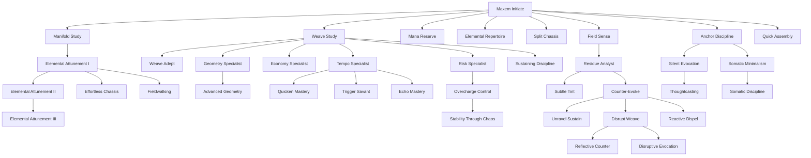

# Maxem Feat Tree Workboard

This page is meant to review and edit the Maxem tree without getting ambushed by downstream dependencies.

**How to use**
- Work top → down (Core → Studies → Weave lines → Counter-work → Element ladders → Magus).
- When you edit a feat, check the “Downstream” list under it before changing prerequisites or terminology.
- Minor preview comes from each feat’s `description` field (frontmatter).

> **Note on prerequisites like `Elemental Attunement (Fire)`**  
> These are **not separate feat notes**. It means “you have *Elemental Attunement* and your chosen Element is Fire.”

---

## Dependency Map (high-level)

## 1) Core Spine

### Core (cards)

> *No results.*

### Core dependency checks (downstream)

#### Maxem Initiate
- [[Introduction]] — —
- [[Tags]] — —
- [[Terminology]] — —
- [[Welcome]] — —
- [[Aether]] — —
- [[Introduction]] — —
- [[Key Differences from other TTRPGS]] — —
- [[Your Character]] — —
- [[2. Pillars of the Game]] — —
- [[Core Combat Rules]] — —
- [[Maxem Combat Rules]] — —
- [[Wounds]] — —
- [[Downtime]] — —
- [[Exploration]] — —
- [[Investigation]] — —
- [[Maxem_Exploration_Rules]] — —
- [[Social]] — —
- [[Ability Scores]] — —
- [[Absorbed]] — —
- [[Blinded]] — —
- [[Broken]] — —
- [[Charmed]] — —
- [[Clumsy]] — —
- [[Concealed]] — —
- [[Conditions]] — —
- [[Confused]] — —
- [[Dazed]] — —
- [[Deafened]] — —
- [[Deluded]] — —
- [[Diminished]] — —
- [[Disconnected]] — —
- [[Doomed]] — —
- [[Drained]] — —
- [[Dumbfounded]] — —
- [[Dying]] — —
- [[Encumbered]] — —
- [[Enfeebled]] — —
- [[Exhausted]] — —
- [[Fatigued]] — —
- [[Fleeing]] — —
- [[Friendly]] — —
- [[Frightened]] — —
- [[Grabbed]] — —
- [[Helpful]] — —
- [[Hexed]] — —
- [[Hidden]] — —
- [[Hostile]] — —
- [[Immobilized]] — —
- [[Indifferent]] — —
- [[Invisible]] — —
- [[Numbed]] — —
- [[Observed]] — —
- [[Off-Guard]] — —
- [[Overwhelmed]] — —
- [[Paralyzed]] — —
- [[Persistent Damage]] — —
- [[Petrified]] — —
- [[Poisoned]] — —
- [[Prone]] — —
- [[Quickened]] — —
- [[Regressing]] — —
- [[Rested]] — —
- [[Restrained]] — —
- [[Scattered]] — —
- [[Sickened]] — —
- [[Slowed]] — —
- [[Stifled]] — —
- [[Stunned]] — —
- [[Stupefied]] — —
- [[Suppressed]] — —
- [[Tired]] — —
- [[Unconscious]] — —
- [[Undetected]] — —
- [[Unfocused]] — —
- [[Unfriendly]] — —
- [[Unnoticed]] — —
- [[Worn]] — —
- [[Equipment]] — —
- [[Feats]] — —
- [[Maladies]] — —
- [[Field Sense]] — —
- [[Imprecise Sense]] — —
- [[Incapacitated Sense]] — —
- [[Light]] — —
- [[Precise Sense]] — —
- [[Vague Sense]] — —
- [[Rest]] — —
- [[Skills]] — —
- [[Vehicles]] — —
- [[Aether]] — —
- [[Evoking]] — —
- [[Reading]] — —
- [[Section Guide]] — —
- [[How to Create your Character]] — —
- [[Leveling up your Character]] — —
- [[The Character Sheet]] — —
- [[2. Ancestries]] — —
- [[Nascedonian]] — —
- [[3. Character Creation]] — —
- [[2. Aether Feats]] — —
- [[Maxem Feats]] — —
- [[Untitled 1 1 1 1]] — —
- [[Untitled 1 1 1]] — —
- [[Untitled 1 1]] — —
- [[Untitled 1]] — —
- [[Untitled]] — —
- [[Core Archetypes]] — —
- [[Section Guide]] — —
- [[Section Guide]] — —
- [[The Tree System]] — —
- [[Armour]] — —
- [[Cloth]] — —
- [[Flow-Channel Gi]] — —
- [[Gambeson]] — —
- [[Gi]] — —
- [[Layered Gambeson]] — —
- [[Padded Tunic]] — —
- [[Quilted Jerkin]] — —
- [[Scroll Robes]] — —
- [[Brigandine]] — —
- [[Ceremonial Gear]] — —
- [[Composite]] — —
- [[Lamellar]] — —
- [[Scale Maille]] — —
- [[Shear-Gel Brigandine]] — —
- [[Splint]] — —
- [[Apron]] — —
- [[Boiled Leather Hauberk]] — —
- [[Leather Armour]] — —
- [[Leather]] — —
- [[Chainmail Hauberk]] — —
- [[Dragon Scale Armour]] — —
- [[Plate]] — —
- [[Scale Armour]] — —
- [[Steel-Threaded Jacket]] — —
- [[Steel]] — —
- [[Leaf Weave]] — —
- [[Livingwood Symbiotic Plate]] — —
- [[Sankeit]] — —
- [[Wood]] — —
- [[Wooden Breastplate]] — —
- [[Wooden Vest Panels]] — —
- [[Armour Crystals]] — —
- [[Armour Upgrades]] — —
- [[Black Iron]] — —
- [[Weapon Crafting and Qualities]] — —
- [[Weapon Crystals]] — —
- [[Weapon Modifications]] — —
- [[Weapon Upgrades]] — —
- [[Poisons]] — —
- [[Potions]] — —
- [[Vials]] — —
- [[Food]] — —
- [[Section Guide]] — —
- [[Black Iron]] — —
- [[Gems]] — —
- [[Money]] — —
- [[Bastard Sword]] — —
- [[Bladed]] — —
- [[Broad Sword]] — —
- [[Buugeng]] — —
- [[Dandpatta]] — —
- [[Dual-Bladed Sword]] — —
- [[Falchion]] — —
- [[Flame-Bladed Sword]] — —
- [[Improvised - Bladed]] — —
- [[Knife]] — —
- [[Longsword]] — —
- [[Rapier]] — —
- [[Sawtooth Saber]] — —
- [[Scimitar]] — —
- [[Shortsword]] — —
- [[Spiral Rapier]] — —
- [[Brawling]] — —
- [[Caetus]] — —
- [[Fist]] — —
- [[Gauntlet]] — —
- [[Improvised - Brawling]] — —
- [[Knuckle Dusters]] — —
- [[Spiked Gauntlet]] — —
- [[Tekko-Kagi]] — —
- [[Weighted Handwraps]] — —
- [[Bladed Diabolo]] — —
- [[Chain Sword]] — —
- [[Chain Whip]] — —
- [[Flail]] — —
- [[Flexible]] — —
- [[Improvised - Flexible]] — —
- [[Kusarigama]] — —
- [[Nunchaku]] — —
- [[Rope Dart]] — —
- [[War Flail]] — —
- [[Whip]] — —
- [[Baton]] — —
- [[Battle Axe]] — —
- [[Club]] — —
- [[Great Axe]] — —
- [[Great Club]] — —
- [[Hatchet]] — —
- [[Horseman's Pick]] — —
- [[Impact]] — —
- [[Improvised - Impact]] — —
- [[Maul]] — —
- [[War Hammer]] — —
- [[War Pick]] — —
- [[Alchemical Crossbow]] — —
- [[Crossbow]] — —
- [[Gauntlet Bow]] — —
- [[Heavy Crossbow]] — —
- [[Heavy Horsebow]] — —
- [[Horsebow]] — —
- [[Improvised - Ranged]] — —
- [[Light Crossbow]] — —
- [[Longbow]] — —
- [[Ranged]] — —
- [[Shortbow]] — —
- [[Warbow]] — —
- [[Shield]] — —
- [[Bec de Corbin]] — —
- [[Glaive]] — —
- [[Greatsword]] — —
- [[Halberd]] — —
- [[Improvised - Sweeping]] — —
- [[Pike]] — —
- [[Quarterstaff]] — —
- [[Staff]] — —
- [[Sweeping]] — —
- [[War Scythe]] — —
- [[Atlatl]] — —
- [[Bola]] — —
- [[Boomerang]] — —
- [[Chakram]] — —
- [[Dart]] — —
- [[Improvised - Throwing]] — —
- [[Javlin]] — —
- [[Shuriken]] — —
- [[Sling]] — —
- [[Slingshot Staff]] — —
- [[Throwing Knife]] — —
- [[Throwing]] — —
- [[Great Spear]] — —
- [[Improvised - Thrusting]] — —
- [[Lance]] — —
- [[Man-Catcher]] — —
- [[Pointed Rapier]] — —
- [[Ranseur]] — —
- [[Spear]] — —
- [[Thrusting]] — —
- [[Trident]] — —
- [[Weapons]] — —
- [[Earth, Blight, and the Consequences of Matter]] — —
- [[Economy]] — —
- [[Languages]] — —
- [[Alchemists]] — —
- [[Artisians]] — —
- [[Blacksmiths]] — —
- [[Chefs]] — —
- [[Healers]] — —
- [[Leatherworker]] — —
- [[Weaver]] — —
- [[Writes]] — —
- [[General Lore]] — —
- [[Holidays and Traditions]] — —
- [[Religion]] — —
- [[Map of Elester]] — —
- [[Calendar]] — —
- [[Numbers and Distances]] — —
- [[Section Guide]] — —
- [[Understanding Difficulty]] — —
- [[Understanding Difficulty]] — —
- [[GM Screen]] — —
- [[Your Notes]] — —
- [[Resist Magic]] — —
- [[Decipher Writing]] — —
- [[Earn Income]] — —
- [[Gather Information]] — —
- [[Exploit Form]] — —
- [[Exploit Intent]] — —
- [[Exploit Presence]] — —
- [[Exploit Weakness]] — —
- [[Anchor Discipline]] — —
- [[Clean Release]] — —
- [[Effortless Chassis]] — —
- [[Field Sense]] — —
- [[Fieldwalking]] — —
- [[Mana Reserve]] — —
- [[Manifold Attunement I]] — —
- [[Manifold Attunement II]] — —
- [[Manifold Attunement III]] — —
- [[Manifold Study]] — —
- [[Maxem Initiate]] — —
- [[Quick Assembly]] — —
- [[Silent Evocation]] — —
- [[Somatic Discipline I]] — —
- [[Somatic Discipline II]] — —
- [[Somatic Minimalism]] — —
- [[Subtle Tint]] — —
- [[Sustaining Discipline]] — —
- [[Thoughtcasting I]] — —
- [[Thoughtcasting II]] — —
- [[Counter-Evoke]] — —
- [[Disrupt Weave]] — —
- [[Disruptive Evocation]] — —
- [[Reactive Dispel]] — —
- [[Reflective Counter]] — —
- [[Residue Analyst]] — —
- [[Unravel Sustain]] — —
- [[Blight - Corrosive Patina]] — —
- [[Blight Technique - Dominance]] — —
- [[Blight Technique - Practical]] — —
- [[Blight Technique - Resistance]] — —
- [[Blight Technique - Signature]] — —
- [[Blight Technique - Sovereign]] — —
- [[Death - Siphoning Touch]] — —
- [[Death Technique - Dominance]] — —
- [[Death Technique - Practical]] — —
- [[Death Technique - Signature]] — —
- [[Death Technique - Sombre]] — —
- [[Death Technique - Sovereign]] — —
- [[Earth - Control]] — —
- [[Earth - Material Truth]] — —
- [[Earth - Materialism]] — —
- [[Earth - Reinforce]] — —
- [[Earth Technique - Dominance]] — —
- [[Earth Technique - Practical]] — —
- [[Earth Technique - Signature]] — —
- [[Earth Technique - Sovereign]] — —
- [[Fire - Blinding Light]] — —
- [[Fire - Materialistic]] — —
- [[Fire - Radiant Discipline]] — —
- [[Fire Technique - Practical]] — —
- [[Fire Technique - Signature]] — —
- [[Fire Technique - Sovereign]] — —
- [[Flow - Kinetic Redirect]] — —
- [[Flow Technique - Dominance]] — —
- [[Flow Technique - Practical]] — —
- [[Flow Technique - Signature]] — —
- [[Flow Technique - Sovereign]] — —
- [[Ice - Cold Architecture]] — —
- [[Ice - Preservation]] — —
- [[Ice - Snap-Freeze]] — —
- [[Ice Technique - Dominance]] — —
- [[Ice Technique - Practical]] — —
- [[Ice Technique - Signature]] — —
- [[Ice Technique - Sovereign]] — —
- [[Life - Guiding Pulse]] — —
- [[Life - Micro-Agency]] — —
- [[Life Technique - Dominance]] — —
- [[Life Technique - Practical]] — —
- [[Life Technique - Signature]] — —
- [[Life Technique - Sovereign]] — —
- [[Magus - Resonant Counter]] — —
- [[Magus Attunement]] — —
- [[Magus Discipline]] — —
- [[Magus Totality]] — —
- [[Static - Ferrous Command]] — —
- [[Static - Truth]] — —
- [[Static - Veilcraft]] — —
- [[Static Technique - Dominance]] — —
- [[Static Technique - Practical]] — —
- [[Static Technique - Signature]] — —
- [[Static Technique - Sovereign]] — —
- [[Feat Tree - Maxem Workboard]] — —
- [[Elemental Repertoire]] — —
- [[Signature Chassis]] — —
- [[Split Chassis]] — —
- [[Advanced Geometry]] — —
- [[Echo Mastery]] — —
- [[Economy Specialist]] — —
- [[Geometry Specialist]] — —
- [[Overcharge Control]] — —
- [[Quicken Mastery]] — —
- [[Risk Specialist]] — —
- [[Stability Through Chaos]] — —
- [[Tempo Specialist]] — —
- [[Trigger Savant]] — —
- [[Weave Adept I]] — —
- [[Weave Adept II]] — —
- [[Weave Study]] — —
- [[Antidote Sip Draft]] — —
- [[Antitoxin Shot]] — —
- [[Armor-Etch Douse]] — —
- [[Hardgrip Draft]] — —
- [[Stoneheart Dust 2]] — —
- [[Waspwind Wash]] — —
- [[Biting Dust]] — —
- [[Bleed-Stop Powder]] — —
- [[Waspwind Draft]] — —
- [[Needle Haze Coat]] — —
- [[Cold Vein Wash 2]] — —
- [[Needle Haze Coat]] — —
- [[Tongue-Tie Draft 2]] — —
- [[Tongue-Tie Draft]] — —
- [[Cold Vein Wash 2]] — —
- [[Wrench-Etch Dust]] — —
- [[Waspwind Wash]] — —
- [[Clear-Thought Draft]] — —
- [[Cold Vein Wash 2]] — —
- [[Restful Broth Wash]] — —
- [[Needle Haze Coat]] — —
- [[Tongue-Tie Draft 2]] — —
- [[Coughing Smoke]] — —
- [[Nerve Fog Meal]] — —
- [[Restful Broth Wash]] — —
- [[Dragonfire Lager]] — —
- [[Waspwind Wash]] — —
- [[Steady Breath Wash]] — —
- [[Ear-Rattle Popper]] — —
- [[Flash Vial]] — —
- [[Needle Haze Coat]] — —
- [[Tongue-Tie Draft]] — —
- [[Glass-Spall Vial]] — —
- [[Wrench-Etch Dust]] — —
- [[Hardgrip Meal]] — —
- [[Hardgrip Draft]] — —
- [[Hardgrip Meal]] — —
- [[Iron-Blood Tonic]] — —
- [[Tongue-Tie Draft]] — —
- [[Restful Broth Wash]] — —
- [[Mind-Haze Vial]] — —
- [[Needle Haze Coat]] — —
- [[Wrench-Etch Dust]] — —
- [[Nerve Fog Meal]] — —
- [[Steady Breath Wash]] — —
- [[Wrench-Etch Dust]] — —
- [[Numb-Needle Coat]] — —
- [[Panic Prickle]] — —
- [[Purifier Wash]] — —
- [[Quick Stitch Poultice]] — —
- [[Wrench-Etch Dust]] — —
- [[Wrench-Etch Meal]] — —
- [[Restful Broth Wash]] — —
- [[Steady Breath Wash]] — —
- [[Restful Broth Wash]] — —
- [[Rustkiss Vial]] — —
- [[Wrench-Etch Dust]] — —
- [[Steady Breath Wash]] — —
- [[Sourflash Wash 2]] — —
- [[Sourflash Wash 2]] — —
- [[Slick-Step Oil]] — —
- [[Smoke-Etch]] — —
- [[Sourflash Wash 2]] — —
- [[Steady Breath Wash]] — —
- [[Stasis Pinprick]] — —
- [[Tongue-Tie Draft]] — —
- [[Steady Breath Wash]] — —
- [[Stoneheart Dust 2]] — —
- [[Wrench-Etch Dust]] — —
- [[Sure-Hand Salve]] — —
- [[Tongue-Tie Draft 2]] — —
- [[Tongue-Tie Draft]] — —
- [[Traveler’s Stew]] — —
- [[Vertigo Puff]] — —
- [[Waspwind Draft]] — —
- [[Waspwind Wash]] — —
- [[Wrench-Etch Dust]] — —
- [[Wrench-Etch Meal]] — —
- [[Cinder Prickle Wash]] — —
- [[Waspwind Draft 2]] — —
- [[Copper Rot Dust]] — —
- [[Blight-Bite Vial]] — —
- [[Restful Broth Wash 2]] — —
- [[Briarburn Wash 2]] — —
- [[Cinder Prickle Wash]] — —
- [[Wrench-Etch Wash]] — —
- [[Copper Rot Dust]] — —
- [[Crampseed Draft]] — —
- [[Restful Broth Wash 2]] — —
- [[Field-Quiet Draught]] — —
- [[Restful Broth Wash 2]] — —
- [[Grime Peel Wash]] — —
- [[Hall-of-Mirrors Dust]] — —
- [[Jitter Dose Wash 2]] — —
- [[Mana-Friction Dust]] — —
- [[Sourflash Dust]] — —
- [[Nerve Fog Wash 2]] — —
- [[Neutral Balm Draft]] — —
- [[Saltbite Draft]] — —
- [[Restful Broth Wash 2]] — —
- [[Saltbite Draft]] — —
- [[Wrench-Etch Wash]] — —
- [[Sourflash Dust]] — —
- [[Stoneheart Wash]] — —
- [[Tongue-Tie Coat]] — —
- [[Waspwind Draft 2]] — —
- [[Wrench-Etch Wash]] — —
- [[Anti-Mana Resin]] — —
- [[Antidote Sip Coat]] — —
- [[Bandage Spray Vial]] — —
- [[Bold Tea Vial]] — —
- [[Clean Rinse Wash 2]] — —
- [[Clear Gaze Wash 2]] — —
- [[Hardgrip Draft 2]] — —
- [[Mass Panic Dust]] — —
- [[Neutral Balm Wash]] — —
- [[Quiet Mind Dust 2]] — —
- [[Restful Broth Wash 3]] — —
- [[Steady Breath Draft 2]] — —
- [[Steel-Eater Vial]] — —
- [[Essence Cards]] — —
- [[Essence Index]] — —
- [[Essence Template]] — —
- [[Aetherical Refinement]] — —
- [[Alchemist Dedication]] — —
- [[Aspirant Dust]] — —
- [[Assassin's Reserve]] — —
- [[Bandolier Discipline]] — —
- [[Banquet Prep]] — —
- [[Calming Tea]] — —
- [[Chain Throw]] — —
- [[Cleanser's Touch]] — —
- [[Coat the Blade]] — —
- [[Composed Brewer]] — —
- [[Counteragent]] — —
- [[Cross-Discipline Research]] — —
- [[Debilitating Mix]] — —
- [[Dragonfire Lager]] — —
- [[Efficient Brewing]] — —
- [[Emergency Counterbrew]] — —
- [[Feast of Legends]] — —
- [[Field Mender]] — —
- [[Focus - Antidoter]] — —
- [[Focus - Grenadier]] — —
- [[Focus - Provisioner]] — —
- [[Focus - Shaman (Chirurgeon)]] — —
- [[Focus - Toxicologist (Assassin)]] — —
- [[Formula Expansion]] — —
- [[Grand Antidote]] — —
- [[Identify Essence]] — —
- [[Inspiring Meal]] — —
- [[Lingering Dose]] — —
- [[Master Essencewright]] — —
- [[Master Toxicologist]] — —
- [[Miracle Poultice]] — —
- [[Panacea Blend]] — —
- [[Prepared Counter]] — —
- [[Quick Administration]] — —
- [[Quiet Ingestion]] — —
- [[Reagent Fieldwork]] — —
- [[Shatter Control]] — —
- [[Siege Grenadier]] — —
- [[Stabilizing Draught]] — —
- [[Steady Quick-Brew]] — —
- [[Trail Cook]] — —
- [[Universal Cleanse]] — —
- [[Volatile Vials]] — —
- [[Wide Cloud]] — —
- [[Alchemist Feat Tree - Antidoter]] — —
- [[Alchemist Feat Tree - Cards]] — —
- [[Alchemist Feat Tree - Grenadier]] — —
- [[Alchemist Feat Tree - Overview]] — —
- [[Alchemist Feat Tree - Provisioner]] — —
- [[Alchemist Feat Tree - Shaman]] — —
- [[Alchemist Feat Tree - Toxicologist]] — —
- [[The Alchemist - Primer]] — —
- [[Armour Group Training (Light) — Repeatable]] — —
- [[Armour Training (Advanced) — Repeatable]] — —
- [[Armour Training (Heavy) — Repeatable]] — —
- [[Armour Training (Medium) — Repeatable]] — —
- [[Shield Use Training]] — —
- [[Unarmed Training (Brawling)]] — —
- [[Weapon Group Training (Simple) — Repeatable]] — —
- [[Weapon Training (Advanced) — Repeatable]] — —
- [[Weapon Training (Martial) — Repeatable]] — —
- [[Armour Specialization Training — Repeatable]] — —
- [[Critical Specialization Training — Repeatable]] — —
- [[Aether Armour Acclimation — Repeatable]] — —
- [[Armour Striking Technique]] — —
- [[Braced Technique]] — —
- [[Entrench Technique]] — —
- [[Positional Defence Technique]] — —
- [[Redirective Defence Technique]] — —
- [[Concealed Carry]] — —
- [[Control Implement Technique]] — —
- [[Parrying Technique]] — —
- [[Tether Handling]] — —
- [[Twin Weapon Technique]] — —
- [[Aimed Shot]] — —
- [[Bait and Punish]] — —
- [[Clinch Control]] — —
- [[Cover Ally]] — —
- [[Crippling Blow]] — —
- [[Disarm]] — —
- [[Drive Back]] — —
- [[False Opening]] — —
- [[Feint]] — —
- [[Grapple]] — —
- [[Guarded Retreat]] — —
- [[Joint Lock]] — —
- [[Leg Hook Mastery]] — —
- [[Pin to Terrain]] — —
- [[Quick Draw Ammo]] — —
- [[Reposition]] — —
- [[Set for Charge]] — —
- [[Shield Bash]] — —
- [[Shield Block]] — —
- [[Shield Shove]] — —
- [[Shove]] — —
- [[Snatch Weapon]] — —
- [[Sunder]] — —
- [[Suppressing Fire]] — —
- [[Takedown]] — —
- [[Trip Follow-Through]] — —
- [[Trip]] — —
- [[Tumble Through]] — —
- [[Wall of Points]] — —
- [[Additional Mount Tricks]] — —
- [[Barding Training (Heavy)]] — —
- [[Barding Training (Light)]] — —
- [[Barding Training (Medium)]] — —
- [[Bonded Mount (Choose One)]] — —
- [[Cavalry Formation Drill]] — —
- [[Couch the Lance]] — —
- [[Courier’s Endurance]] — —
- [[Emergency Dismount]] — —
- [[Knee Control]] — —
- [[Mount as Cover]] — —
- [[Mount Proficiency (Draft Mounts)]] — —
- [[Mount Proficiency (Exotic Mounts)]] — —
- [[Mount Proficiency (Pack Mounts)]] — —
- [[Mount Proficiency (Riding Mounts)]] — —
- [[Mount Proficiency (War Mounts)]] — —
- [[Mount Tricks (Choose Two)]] — —
- [[Mounted Archer]] — —
- [[Mounted Armour Drill (Heavy)]] — —
- [[Mounted Armour Drill (Medium)]] — —
- [[Mounted Charge]] — —
- [[Mounted Shield Drill]] — —
- [[Mounted Two-Handed Drill]] — —
- [[Mounted Weapon Drill — Repeatable]] — —
- [[Pack Logistics]] — —
- [[Parthian Shot]] — —
- [[Protect the Mount]] — —
- [[Quick Mount]] — —
- [[Ride-By Attack]] — —
- [[Rider’s Seat]] — —
- [[Stay in the Saddle]] — —
- [[Thrown From the Saddle]] — —
- [[War Mount Drills]] — —
- [[Wedge Charge]] — —
- [[Combat Rules - Martial (Mounted)]] — —
- [[Combat Rules - Martial]] — —
- [[Martial Feat Tree — Cards (Practical v3)]] — —
- [[Martial Feat Tree — Workboard (Practical v3)]] — —
- [[README]] — —
- [[Feat Template — Martial]] — —
- [[Analyst Dedication]] — —
- [[Companion Dedication]] — —
- [[Coordinated Reactions]] — —
- [[Counterpoint]] — —
- [[De-escalate]] — —
- [[Deep Classification]] — —
- [[Double Mark]] — —
- [[Exploit Form]] — —
- [[Field Partner]] — —
- [[Focus Fire]] — —
- [[Guarding Interpose]] — —
- [[Herald Dedication]] — —
- [[Hunter's Thread]] — —
- [[Increase Maximum Strain]] — —
- [[Live Read]] — —
- [[Needlepoint Question]] — —
- [[Officer's Orders]] — —
- [[Omnidomain Insight]] — —
- [[Pack Signals]] — —
- [[Pattern Break]] — —
- [[Perfect Translation]] — —
- [[Predictive Step]] — —
- [[Quick Mark]] — —
- [[Quick Tune]] — —
- [[Read the Room]] — —
- [[Relay Mark]] — —
- [[Shared Senses]] — —
- [[Shared Thread]] — —
- [[Signal Clarity]] — —
- [[Sincere Pressure]] — —
- [[Speaker Dedication]] — —
- [[Take the Heat]] — —
- [[Thread Anchor]] — —
- [[Thread Compression]] — —
- [[Threadmaster]] — —
- [[Vasilian Analyze Pattern]] — —
- [[Vasilian Catch Contradiction]] — —
- [[Vasilian De-escalate]] — —
- [[Vasilian Discipline]] — —
- [[Vasilian Exploit Form]] — —
- [[Vasilian Focus Fire]] — —
- [[Vasilian Guarding Interpose]] — —
- [[Vasilian Index]] — —
- [[Vasilian Initiate]] — —
- [[Vasilian Mark]] — —
- [[Vasilian Needlepoint Question]] — —
- [[Vasilian Officer's Orders]] — —
- [[Vasilian Opening Callout]] — —
- [[Vasilian Pattern Break]] — —
- [[Vasilian Predictive Step]] — —
- [[Vasilian Quick Mark]] — —
- [[Vasilian Quick Tune]] — —
- [[Vasilian Rally Thread]] — —
- [[Vasilian Read the Room]] — —
- [[Vasilian Relay Mark]] — —
- [[Vasilian Sage]] — —
- [[Vasilian Shared Senses]] — —
- [[Vasilian Sincere Pressure]] — —
- [[Vasilian Take the Heat]] — —
- [[Vasilian Tune]] — —
- [[Vasilian Virtuoso]] — —
- [[Vasilian Weak Point Callout]] — —
- [[Weak Point Callout]] — —
- [[Read]] — —
- [[Destroy]] — —
- [[Poison]] — —
- [[Recast]] — —
- [[Reshape]] — —
- [[Deplete]] — —
- [[Exhaust]] — —
- [[Hex]] — —
- [[Mind-Block]] — —
- [[Rot]] — —
- [[Siphon]] — —
- [[Suggest]] — —
- [[Tire]] — —
- [[Wither]] — —
- [[Assay]] — —
- [[Create]] — —
- [[Move]] — —
- [[Purify]] — —
- [[Transmute]] — —
- [[Boil]] — —
- [[Conductive]] — —
- [[Contractive]] — —
- [[Excited]] — —
- [[Hot Flows]] — —
- [[Ignition]] — —
- [[Launch]] — —
- [[Radiance]] — —
- [[Spiked]] — —
- [[Aware]] — —
- [[Drift]] — —
- [[Gravity Hold]] — —
- [[Haste]] — —
- [[Instinctive]] — —
- [[Push]] — —
- [[Slow]] — —
- [[Chill]] — —
- [[Cold Flows]] — —
- [[Condense]] — —
- [[Contracted]] — —
- [[Convective]] — —
- [[Reduce]] — —
- [[Shards]] — —
- [[Slowed]] — —
- [[Suspend]] — —
- [[Animate]] — —
- [[Blessing]] — —
- [[Courage]] — —
- [[Cultivate]] — —
- [[Endorphal]] — —
- [[Keen]] — —
- [[Regenerate]] — —
- [[Stabilize]] — —
- [[Swarmlet]] — —
- [[Vitalize]] — —
- [[Arc]] — —
- [[Brighten]] — —
- [[Darken]] — —
- [[Darkvision]] — —
- [[Demagnetize]] — —
- [[Electrify]] — —
- [[Illusion]] — —
- [[Magnetize]] — —
- [[Shock]] — —
- [[Advanced Area]] — —
- [[Anchor]] — —
- [[Area]] — —
- [[Augment]] — —
- [[Conserve]] — —
- [[Direct]] — —
- [[Duration]] — —
- [[Echo]] — —
- [[Enhanced]] — —
- [[Geometric Exclusion]] — —
- [[Heighten]] — —
- [[Hold]] — —
- [[Overcharge]] — —
- [[Quicken]] — —
- [[Raise Floor]] — —
- [[Range]] — —
- [[Sustain]] — —
- [[Touch]] — —
- [[Trigger]] — —
- [[Unstable]] — —
- [[Wild Potential]] — —
- [[Energy]] — —
- [[Existence]] — —
- [[Force]] — —
- [[Thought]] — —
- [[index]] — —
- [[README]] — —
- [[Armour Group]] — —
- [[Weapon Group]] — —
- [[Ancestry]] — —
- [[Armour]] — —
- [[Condition]] — —
- [[Descriptive Action]] — —
- [[Feat]] — —
- [[Item Category]] — —
- [[Manifold]] — —
- [[Simple Action]] — —
- [[Weapon]] — —
- [[Weave]] — —
- [[Advanced Tables Formula]] — —

#### Elemental Attunement
- [[Introduction]] — —
- [[Tags]] — —
- [[Terminology]] — —
- [[Welcome]] — —
- [[Aether]] — —
- [[Introduction]] — —
- [[Key Differences from other TTRPGS]] — —
- [[Your Character]] — —
- [[2. Pillars of the Game]] — —
- [[Core Combat Rules]] — —
- [[Maxem Combat Rules]] — —
- [[Wounds]] — —
- [[Downtime]] — —
- [[Exploration]] — —
- [[Investigation]] — —
- [[Maxem_Exploration_Rules]] — —
- [[Social]] — —
- [[Ability Scores]] — —
- [[Absorbed]] — —
- [[Blinded]] — —
- [[Broken]] — —
- [[Charmed]] — —
- [[Clumsy]] — —
- [[Concealed]] — —
- [[Conditions]] — —
- [[Confused]] — —
- [[Dazed]] — —
- [[Deafened]] — —
- [[Deluded]] — —
- [[Diminished]] — —
- [[Disconnected]] — —
- [[Doomed]] — —
- [[Drained]] — —
- [[Dumbfounded]] — —
- [[Dying]] — —
- [[Encumbered]] — —
- [[Enfeebled]] — —
- [[Exhausted]] — —
- [[Fatigued]] — —
- [[Fleeing]] — —
- [[Friendly]] — —
- [[Frightened]] — —
- [[Grabbed]] — —
- [[Helpful]] — —
- [[Hexed]] — —
- [[Hidden]] — —
- [[Hostile]] — —
- [[Immobilized]] — —
- [[Indifferent]] — —
- [[Invisible]] — —
- [[Numbed]] — —
- [[Observed]] — —
- [[Off-Guard]] — —
- [[Overwhelmed]] — —
- [[Paralyzed]] — —
- [[Persistent Damage]] — —
- [[Petrified]] — —
- [[Poisoned]] — —
- [[Prone]] — —
- [[Quickened]] — —
- [[Regressing]] — —
- [[Rested]] — —
- [[Restrained]] — —
- [[Scattered]] — —
- [[Sickened]] — —
- [[Slowed]] — —
- [[Stifled]] — —
- [[Stunned]] — —
- [[Stupefied]] — —
- [[Suppressed]] — —
- [[Tired]] — —
- [[Unconscious]] — —
- [[Undetected]] — —
- [[Unfocused]] — —
- [[Unfriendly]] — —
- [[Unnoticed]] — —
- [[Worn]] — —
- [[Equipment]] — —
- [[Feats]] — —
- [[Maladies]] — —
- [[Field Sense]] — —
- [[Imprecise Sense]] — —
- [[Incapacitated Sense]] — —
- [[Light]] — —
- [[Precise Sense]] — —
- [[Vague Sense]] — —
- [[Rest]] — —
- [[Skills]] — —
- [[Vehicles]] — —
- [[Aether]] — —
- [[Evoking]] — —
- [[Reading]] — —
- [[Section Guide]] — —
- [[How to Create your Character]] — —
- [[Leveling up your Character]] — —
- [[The Character Sheet]] — —
- [[2. Ancestries]] — —
- [[Nascedonian]] — —
- [[3. Character Creation]] — —
- [[2. Aether Feats]] — —
- [[Maxem Feats]] — —
- [[Untitled 1 1 1 1]] — —
- [[Untitled 1 1 1]] — —
- [[Untitled 1 1]] — —
- [[Untitled 1]] — —
- [[Untitled]] — —
- [[Core Archetypes]] — —
- [[Section Guide]] — —
- [[Section Guide]] — —
- [[The Tree System]] — —
- [[Armour]] — —
- [[Cloth]] — —
- [[Flow-Channel Gi]] — —
- [[Gambeson]] — —
- [[Gi]] — —
- [[Layered Gambeson]] — —
- [[Padded Tunic]] — —
- [[Quilted Jerkin]] — —
- [[Scroll Robes]] — —
- [[Brigandine]] — —
- [[Ceremonial Gear]] — —
- [[Composite]] — —
- [[Lamellar]] — —
- [[Scale Maille]] — —
- [[Shear-Gel Brigandine]] — —
- [[Splint]] — —
- [[Apron]] — —
- [[Boiled Leather Hauberk]] — —
- [[Leather Armour]] — —
- [[Leather]] — —
- [[Chainmail Hauberk]] — —
- [[Dragon Scale Armour]] — —
- [[Plate]] — —
- [[Scale Armour]] — —
- [[Steel-Threaded Jacket]] — —
- [[Steel]] — —
- [[Leaf Weave]] — —
- [[Livingwood Symbiotic Plate]] — —
- [[Sankeit]] — —
- [[Wood]] — —
- [[Wooden Breastplate]] — —
- [[Wooden Vest Panels]] — —
- [[Armour Crystals]] — —
- [[Armour Upgrades]] — —
- [[Black Iron]] — —
- [[Weapon Crafting and Qualities]] — —
- [[Weapon Crystals]] — —
- [[Weapon Modifications]] — —
- [[Weapon Upgrades]] — —
- [[Poisons]] — —
- [[Potions]] — —
- [[Vials]] — —
- [[Food]] — —
- [[Section Guide]] — —
- [[Black Iron]] — —
- [[Gems]] — —
- [[Money]] — —
- [[Bastard Sword]] — —
- [[Bladed]] — —
- [[Broad Sword]] — —
- [[Buugeng]] — —
- [[Dandpatta]] — —
- [[Dual-Bladed Sword]] — —
- [[Falchion]] — —
- [[Flame-Bladed Sword]] — —
- [[Improvised - Bladed]] — —
- [[Knife]] — —
- [[Longsword]] — —
- [[Rapier]] — —
- [[Sawtooth Saber]] — —
- [[Scimitar]] — —
- [[Shortsword]] — —
- [[Spiral Rapier]] — —
- [[Brawling]] — —
- [[Caetus]] — —
- [[Fist]] — —
- [[Gauntlet]] — —
- [[Improvised - Brawling]] — —
- [[Knuckle Dusters]] — —
- [[Spiked Gauntlet]] — —
- [[Tekko-Kagi]] — —
- [[Weighted Handwraps]] — —
- [[Bladed Diabolo]] — —
- [[Chain Sword]] — —
- [[Chain Whip]] — —
- [[Flail]] — —
- [[Flexible]] — —
- [[Improvised - Flexible]] — —
- [[Kusarigama]] — —
- [[Nunchaku]] — —
- [[Rope Dart]] — —
- [[War Flail]] — —
- [[Whip]] — —
- [[Baton]] — —
- [[Battle Axe]] — —
- [[Club]] — —
- [[Great Axe]] — —
- [[Great Club]] — —
- [[Hatchet]] — —
- [[Horseman's Pick]] — —
- [[Impact]] — —
- [[Improvised - Impact]] — —
- [[Maul]] — —
- [[War Hammer]] — —
- [[War Pick]] — —
- [[Alchemical Crossbow]] — —
- [[Crossbow]] — —
- [[Gauntlet Bow]] — —
- [[Heavy Crossbow]] — —
- [[Heavy Horsebow]] — —
- [[Horsebow]] — —
- [[Improvised - Ranged]] — —
- [[Light Crossbow]] — —
- [[Longbow]] — —
- [[Ranged]] — —
- [[Shortbow]] — —
- [[Warbow]] — —
- [[Shield]] — —
- [[Bec de Corbin]] — —
- [[Glaive]] — —
- [[Greatsword]] — —
- [[Halberd]] — —
- [[Improvised - Sweeping]] — —
- [[Pike]] — —
- [[Quarterstaff]] — —
- [[Staff]] — —
- [[Sweeping]] — —
- [[War Scythe]] — —
- [[Atlatl]] — —
- [[Bola]] — —
- [[Boomerang]] — —
- [[Chakram]] — —
- [[Dart]] — —
- [[Improvised - Throwing]] — —
- [[Javlin]] — —
- [[Shuriken]] — —
- [[Sling]] — —
- [[Slingshot Staff]] — —
- [[Throwing Knife]] — —
- [[Throwing]] — —
- [[Great Spear]] — —
- [[Improvised - Thrusting]] — —
- [[Lance]] — —
- [[Man-Catcher]] — —
- [[Pointed Rapier]] — —
- [[Ranseur]] — —
- [[Spear]] — —
- [[Thrusting]] — —
- [[Trident]] — —
- [[Weapons]] — —
- [[Earth, Blight, and the Consequences of Matter]] — —
- [[Economy]] — —
- [[Languages]] — —
- [[Alchemists]] — —
- [[Artisians]] — —
- [[Blacksmiths]] — —
- [[Chefs]] — —
- [[Healers]] — —
- [[Leatherworker]] — —
- [[Weaver]] — —
- [[Writes]] — —
- [[General Lore]] — —
- [[Holidays and Traditions]] — —
- [[Religion]] — —
- [[Map of Elester]] — —
- [[Calendar]] — —
- [[Numbers and Distances]] — —
- [[Section Guide]] — —
- [[Understanding Difficulty]] — —
- [[Understanding Difficulty]] — —
- [[GM Screen]] — —
- [[Your Notes]] — —
- [[Resist Magic]] — —
- [[Decipher Writing]] — —
- [[Earn Income]] — —
- [[Gather Information]] — —
- [[Exploit Form]] — —
- [[Exploit Intent]] — —
- [[Exploit Presence]] — —
- [[Exploit Weakness]] — —
- [[Anchor Discipline]] — —
- [[Clean Release]] — —
- [[Effortless Chassis]] — —
- [[Field Sense]] — —
- [[Fieldwalking]] — —
- [[Mana Reserve]] — —
- [[Manifold Attunement I]] — —
- [[Manifold Attunement II]] — —
- [[Manifold Attunement III]] — —
- [[Manifold Study]] — —
- [[Maxem Initiate]] — —
- [[Quick Assembly]] — —
- [[Silent Evocation]] — —
- [[Somatic Discipline I]] — —
- [[Somatic Discipline II]] — —
- [[Somatic Minimalism]] — —
- [[Subtle Tint]] — —
- [[Sustaining Discipline]] — —
- [[Thoughtcasting I]] — —
- [[Thoughtcasting II]] — —
- [[Counter-Evoke]] — —
- [[Disrupt Weave]] — —
- [[Disruptive Evocation]] — —
- [[Reactive Dispel]] — —
- [[Reflective Counter]] — —
- [[Residue Analyst]] — —
- [[Unravel Sustain]] — —
- [[Blight - Corrosive Patina]] — —
- [[Blight Technique - Dominance]] — —
- [[Blight Technique - Practical]] — —
- [[Blight Technique - Resistance]] — —
- [[Blight Technique - Signature]] — —
- [[Blight Technique - Sovereign]] — —
- [[Death - Siphoning Touch]] — —
- [[Death Technique - Dominance]] — —
- [[Death Technique - Practical]] — —
- [[Death Technique - Signature]] — —
- [[Death Technique - Sombre]] — —
- [[Death Technique - Sovereign]] — —
- [[Earth - Control]] — —
- [[Earth - Material Truth]] — —
- [[Earth - Materialism]] — —
- [[Earth - Reinforce]] — —
- [[Earth Technique - Dominance]] — —
- [[Earth Technique - Practical]] — —
- [[Earth Technique - Signature]] — —
- [[Earth Technique - Sovereign]] — —
- [[Fire - Blinding Light]] — —
- [[Fire - Materialistic]] — —
- [[Fire - Radiant Discipline]] — —
- [[Fire Technique - Practical]] — —
- [[Fire Technique - Signature]] — —
- [[Fire Technique - Sovereign]] — —
- [[Flow - Kinetic Redirect]] — —
- [[Flow Technique - Dominance]] — —
- [[Flow Technique - Practical]] — —
- [[Flow Technique - Signature]] — —
- [[Flow Technique - Sovereign]] — —
- [[Ice - Cold Architecture]] — —
- [[Ice - Preservation]] — —
- [[Ice - Snap-Freeze]] — —
- [[Ice Technique - Dominance]] — —
- [[Ice Technique - Practical]] — —
- [[Ice Technique - Signature]] — —
- [[Ice Technique - Sovereign]] — —
- [[Life - Guiding Pulse]] — —
- [[Life - Micro-Agency]] — —
- [[Life Technique - Dominance]] — —
- [[Life Technique - Practical]] — —
- [[Life Technique - Signature]] — —
- [[Life Technique - Sovereign]] — —
- [[Magus - Resonant Counter]] — —
- [[Magus Attunement]] — —
- [[Magus Discipline]] — —
- [[Magus Totality]] — —
- [[Static - Ferrous Command]] — —
- [[Static - Truth]] — —
- [[Static - Veilcraft]] — —
- [[Static Technique - Dominance]] — —
- [[Static Technique - Practical]] — —
- [[Static Technique - Signature]] — —
- [[Static Technique - Sovereign]] — —
- [[Feat Tree - Maxem Workboard]] — —
- [[Elemental Repertoire]] — —
- [[Signature Chassis]] — —
- [[Split Chassis]] — —
- [[Advanced Geometry]] — —
- [[Echo Mastery]] — —
- [[Economy Specialist]] — —
- [[Geometry Specialist]] — —
- [[Overcharge Control]] — —
- [[Quicken Mastery]] — —
- [[Risk Specialist]] — —
- [[Stability Through Chaos]] — —
- [[Tempo Specialist]] — —
- [[Trigger Savant]] — —
- [[Weave Adept I]] — —
- [[Weave Adept II]] — —
- [[Weave Study]] — —
- [[Antidote Sip Draft]] — —
- [[Antitoxin Shot]] — —
- [[Armor-Etch Douse]] — —
- [[Hardgrip Draft]] — —
- [[Stoneheart Dust 2]] — —
- [[Waspwind Wash]] — —
- [[Biting Dust]] — —
- [[Bleed-Stop Powder]] — —
- [[Waspwind Draft]] — —
- [[Needle Haze Coat]] — —
- [[Cold Vein Wash 2]] — —
- [[Needle Haze Coat]] — —
- [[Tongue-Tie Draft 2]] — —
- [[Tongue-Tie Draft]] — —
- [[Cold Vein Wash 2]] — —
- [[Wrench-Etch Dust]] — —
- [[Waspwind Wash]] — —
- [[Clear-Thought Draft]] — —
- [[Cold Vein Wash 2]] — —
- [[Restful Broth Wash]] — —
- [[Needle Haze Coat]] — —
- [[Tongue-Tie Draft 2]] — —
- [[Coughing Smoke]] — —
- [[Nerve Fog Meal]] — —
- [[Restful Broth Wash]] — —
- [[Dragonfire Lager]] — —
- [[Waspwind Wash]] — —
- [[Steady Breath Wash]] — —
- [[Ear-Rattle Popper]] — —
- [[Flash Vial]] — —
- [[Needle Haze Coat]] — —
- [[Tongue-Tie Draft]] — —
- [[Glass-Spall Vial]] — —
- [[Wrench-Etch Dust]] — —
- [[Hardgrip Meal]] — —
- [[Hardgrip Draft]] — —
- [[Hardgrip Meal]] — —
- [[Iron-Blood Tonic]] — —
- [[Tongue-Tie Draft]] — —
- [[Restful Broth Wash]] — —
- [[Mind-Haze Vial]] — —
- [[Needle Haze Coat]] — —
- [[Wrench-Etch Dust]] — —
- [[Nerve Fog Meal]] — —
- [[Steady Breath Wash]] — —
- [[Wrench-Etch Dust]] — —
- [[Numb-Needle Coat]] — —
- [[Panic Prickle]] — —
- [[Purifier Wash]] — —
- [[Quick Stitch Poultice]] — —
- [[Wrench-Etch Dust]] — —
- [[Wrench-Etch Meal]] — —
- [[Restful Broth Wash]] — —
- [[Steady Breath Wash]] — —
- [[Restful Broth Wash]] — —
- [[Rustkiss Vial]] — —
- [[Wrench-Etch Dust]] — —
- [[Steady Breath Wash]] — —
- [[Sourflash Wash 2]] — —
- [[Sourflash Wash 2]] — —
- [[Slick-Step Oil]] — —
- [[Smoke-Etch]] — —
- [[Sourflash Wash 2]] — —
- [[Steady Breath Wash]] — —
- [[Stasis Pinprick]] — —
- [[Tongue-Tie Draft]] — —
- [[Steady Breath Wash]] — —
- [[Stoneheart Dust 2]] — —
- [[Wrench-Etch Dust]] — —
- [[Sure-Hand Salve]] — —
- [[Tongue-Tie Draft 2]] — —
- [[Tongue-Tie Draft]] — —
- [[Traveler’s Stew]] — —
- [[Vertigo Puff]] — —
- [[Waspwind Draft]] — —
- [[Waspwind Wash]] — —
- [[Wrench-Etch Dust]] — —
- [[Wrench-Etch Meal]] — —
- [[Cinder Prickle Wash]] — —
- [[Waspwind Draft 2]] — —
- [[Copper Rot Dust]] — —
- [[Blight-Bite Vial]] — —
- [[Restful Broth Wash 2]] — —
- [[Briarburn Wash 2]] — —
- [[Cinder Prickle Wash]] — —
- [[Wrench-Etch Wash]] — —
- [[Copper Rot Dust]] — —
- [[Crampseed Draft]] — —
- [[Restful Broth Wash 2]] — —
- [[Field-Quiet Draught]] — —
- [[Restful Broth Wash 2]] — —
- [[Grime Peel Wash]] — —
- [[Hall-of-Mirrors Dust]] — —
- [[Jitter Dose Wash 2]] — —
- [[Mana-Friction Dust]] — —
- [[Sourflash Dust]] — —
- [[Nerve Fog Wash 2]] — —
- [[Neutral Balm Draft]] — —
- [[Saltbite Draft]] — —
- [[Restful Broth Wash 2]] — —
- [[Saltbite Draft]] — —
- [[Wrench-Etch Wash]] — —
- [[Sourflash Dust]] — —
- [[Stoneheart Wash]] — —
- [[Tongue-Tie Coat]] — —
- [[Waspwind Draft 2]] — —
- [[Wrench-Etch Wash]] — —
- [[Anti-Mana Resin]] — —
- [[Antidote Sip Coat]] — —
- [[Bandage Spray Vial]] — —
- [[Bold Tea Vial]] — —
- [[Clean Rinse Wash 2]] — —
- [[Clear Gaze Wash 2]] — —
- [[Hardgrip Draft 2]] — —
- [[Mass Panic Dust]] — —
- [[Neutral Balm Wash]] — —
- [[Quiet Mind Dust 2]] — —
- [[Restful Broth Wash 3]] — —
- [[Steady Breath Draft 2]] — —
- [[Steel-Eater Vial]] — —
- [[Essence Cards]] — —
- [[Essence Index]] — —
- [[Essence Template]] — —
- [[Aetherical Refinement]] — —
- [[Alchemist Dedication]] — —
- [[Aspirant Dust]] — —
- [[Assassin's Reserve]] — —
- [[Bandolier Discipline]] — —
- [[Banquet Prep]] — —
- [[Calming Tea]] — —
- [[Chain Throw]] — —
- [[Cleanser's Touch]] — —
- [[Coat the Blade]] — —
- [[Composed Brewer]] — —
- [[Counteragent]] — —
- [[Cross-Discipline Research]] — —
- [[Debilitating Mix]] — —
- [[Dragonfire Lager]] — —
- [[Efficient Brewing]] — —
- [[Emergency Counterbrew]] — —
- [[Feast of Legends]] — —
- [[Field Mender]] — —
- [[Focus - Antidoter]] — —
- [[Focus - Grenadier]] — —
- [[Focus - Provisioner]] — —
- [[Focus - Shaman (Chirurgeon)]] — —
- [[Focus - Toxicologist (Assassin)]] — —
- [[Formula Expansion]] — —
- [[Grand Antidote]] — —
- [[Identify Essence]] — —
- [[Inspiring Meal]] — —
- [[Lingering Dose]] — —
- [[Master Essencewright]] — —
- [[Master Toxicologist]] — —
- [[Miracle Poultice]] — —
- [[Panacea Blend]] — —
- [[Prepared Counter]] — —
- [[Quick Administration]] — —
- [[Quiet Ingestion]] — —
- [[Reagent Fieldwork]] — —
- [[Shatter Control]] — —
- [[Siege Grenadier]] — —
- [[Stabilizing Draught]] — —
- [[Steady Quick-Brew]] — —
- [[Trail Cook]] — —
- [[Universal Cleanse]] — —
- [[Volatile Vials]] — —
- [[Wide Cloud]] — —
- [[Alchemist Feat Tree - Antidoter]] — —
- [[Alchemist Feat Tree - Cards]] — —
- [[Alchemist Feat Tree - Grenadier]] — —
- [[Alchemist Feat Tree - Overview]] — —
- [[Alchemist Feat Tree - Provisioner]] — —
- [[Alchemist Feat Tree - Shaman]] — —
- [[Alchemist Feat Tree - Toxicologist]] — —
- [[The Alchemist - Primer]] — —
- [[Armour Group Training (Light) — Repeatable]] — —
- [[Armour Training (Advanced) — Repeatable]] — —
- [[Armour Training (Heavy) — Repeatable]] — —
- [[Armour Training (Medium) — Repeatable]] — —
- [[Shield Use Training]] — —
- [[Unarmed Training (Brawling)]] — —
- [[Weapon Group Training (Simple) — Repeatable]] — —
- [[Weapon Training (Advanced) — Repeatable]] — —
- [[Weapon Training (Martial) — Repeatable]] — —
- [[Armour Specialization Training — Repeatable]] — —
- [[Critical Specialization Training — Repeatable]] — —
- [[Aether Armour Acclimation — Repeatable]] — —
- [[Armour Striking Technique]] — —
- [[Braced Technique]] — —
- [[Entrench Technique]] — —
- [[Positional Defence Technique]] — —
- [[Redirective Defence Technique]] — —
- [[Concealed Carry]] — —
- [[Control Implement Technique]] — —
- [[Parrying Technique]] — —
- [[Tether Handling]] — —
- [[Twin Weapon Technique]] — —
- [[Aimed Shot]] — —
- [[Bait and Punish]] — —
- [[Clinch Control]] — —
- [[Cover Ally]] — —
- [[Crippling Blow]] — —
- [[Disarm]] — —
- [[Drive Back]] — —
- [[False Opening]] — —
- [[Feint]] — —
- [[Grapple]] — —
- [[Guarded Retreat]] — —
- [[Joint Lock]] — —
- [[Leg Hook Mastery]] — —
- [[Pin to Terrain]] — —
- [[Quick Draw Ammo]] — —
- [[Reposition]] — —
- [[Set for Charge]] — —
- [[Shield Bash]] — —
- [[Shield Block]] — —
- [[Shield Shove]] — —
- [[Shove]] — —
- [[Snatch Weapon]] — —
- [[Sunder]] — —
- [[Suppressing Fire]] — —
- [[Takedown]] — —
- [[Trip Follow-Through]] — —
- [[Trip]] — —
- [[Tumble Through]] — —
- [[Wall of Points]] — —
- [[Additional Mount Tricks]] — —
- [[Barding Training (Heavy)]] — —
- [[Barding Training (Light)]] — —
- [[Barding Training (Medium)]] — —
- [[Bonded Mount (Choose One)]] — —
- [[Cavalry Formation Drill]] — —
- [[Couch the Lance]] — —
- [[Courier’s Endurance]] — —
- [[Emergency Dismount]] — —
- [[Knee Control]] — —
- [[Mount as Cover]] — —
- [[Mount Proficiency (Draft Mounts)]] — —
- [[Mount Proficiency (Exotic Mounts)]] — —
- [[Mount Proficiency (Pack Mounts)]] — —
- [[Mount Proficiency (Riding Mounts)]] — —
- [[Mount Proficiency (War Mounts)]] — —
- [[Mount Tricks (Choose Two)]] — —
- [[Mounted Archer]] — —
- [[Mounted Armour Drill (Heavy)]] — —
- [[Mounted Armour Drill (Medium)]] — —
- [[Mounted Charge]] — —
- [[Mounted Shield Drill]] — —
- [[Mounted Two-Handed Drill]] — —
- [[Mounted Weapon Drill — Repeatable]] — —
- [[Pack Logistics]] — —
- [[Parthian Shot]] — —
- [[Protect the Mount]] — —
- [[Quick Mount]] — —
- [[Ride-By Attack]] — —
- [[Rider’s Seat]] — —
- [[Stay in the Saddle]] — —
- [[Thrown From the Saddle]] — —
- [[War Mount Drills]] — —
- [[Wedge Charge]] — —
- [[Combat Rules - Martial (Mounted)]] — —
- [[Combat Rules - Martial]] — —
- [[Martial Feat Tree — Cards (Practical v3)]] — —
- [[Martial Feat Tree — Workboard (Practical v3)]] — —
- [[README]] — —
- [[Feat Template — Martial]] — —
- [[Analyst Dedication]] — —
- [[Companion Dedication]] — —
- [[Coordinated Reactions]] — —
- [[Counterpoint]] — —
- [[De-escalate]] — —
- [[Deep Classification]] — —
- [[Double Mark]] — —
- [[Exploit Form]] — —
- [[Field Partner]] — —
- [[Focus Fire]] — —
- [[Guarding Interpose]] — —
- [[Herald Dedication]] — —
- [[Hunter's Thread]] — —
- [[Increase Maximum Strain]] — —
- [[Live Read]] — —
- [[Needlepoint Question]] — —
- [[Officer's Orders]] — —
- [[Omnidomain Insight]] — —
- [[Pack Signals]] — —
- [[Pattern Break]] — —
- [[Perfect Translation]] — —
- [[Predictive Step]] — —
- [[Quick Mark]] — —
- [[Quick Tune]] — —
- [[Read the Room]] — —
- [[Relay Mark]] — —
- [[Shared Senses]] — —
- [[Shared Thread]] — —
- [[Signal Clarity]] — —
- [[Sincere Pressure]] — —
- [[Speaker Dedication]] — —
- [[Take the Heat]] — —
- [[Thread Anchor]] — —
- [[Thread Compression]] — —
- [[Threadmaster]] — —
- [[Vasilian Analyze Pattern]] — —
- [[Vasilian Catch Contradiction]] — —
- [[Vasilian De-escalate]] — —
- [[Vasilian Discipline]] — —
- [[Vasilian Exploit Form]] — —
- [[Vasilian Focus Fire]] — —
- [[Vasilian Guarding Interpose]] — —
- [[Vasilian Index]] — —
- [[Vasilian Initiate]] — —
- [[Vasilian Mark]] — —
- [[Vasilian Needlepoint Question]] — —
- [[Vasilian Officer's Orders]] — —
- [[Vasilian Opening Callout]] — —
- [[Vasilian Pattern Break]] — —
- [[Vasilian Predictive Step]] — —
- [[Vasilian Quick Mark]] — —
- [[Vasilian Quick Tune]] — —
- [[Vasilian Rally Thread]] — —
- [[Vasilian Read the Room]] — —
- [[Vasilian Relay Mark]] — —
- [[Vasilian Sage]] — —
- [[Vasilian Shared Senses]] — —
- [[Vasilian Sincere Pressure]] — —
- [[Vasilian Take the Heat]] — —
- [[Vasilian Tune]] — —
- [[Vasilian Virtuoso]] — —
- [[Vasilian Weak Point Callout]] — —
- [[Weak Point Callout]] — —
- [[Read]] — —
- [[Destroy]] — —
- [[Poison]] — —
- [[Recast]] — —
- [[Reshape]] — —
- [[Deplete]] — —
- [[Exhaust]] — —
- [[Hex]] — —
- [[Mind-Block]] — —
- [[Rot]] — —
- [[Siphon]] — —
- [[Suggest]] — —
- [[Tire]] — —
- [[Wither]] — —
- [[Assay]] — —
- [[Create]] — —
- [[Move]] — —
- [[Purify]] — —
- [[Transmute]] — —
- [[Boil]] — —
- [[Conductive]] — —
- [[Contractive]] — —
- [[Excited]] — —
- [[Hot Flows]] — —
- [[Ignition]] — —
- [[Launch]] — —
- [[Radiance]] — —
- [[Spiked]] — —
- [[Aware]] — —
- [[Drift]] — —
- [[Gravity Hold]] — —
- [[Haste]] — —
- [[Instinctive]] — —
- [[Push]] — —
- [[Slow]] — —
- [[Chill]] — —
- [[Cold Flows]] — —
- [[Condense]] — —
- [[Contracted]] — —
- [[Convective]] — —
- [[Reduce]] — —
- [[Shards]] — —
- [[Slowed]] — —
- [[Suspend]] — —
- [[Animate]] — —
- [[Blessing]] — —
- [[Courage]] — —
- [[Cultivate]] — —
- [[Endorphal]] — —
- [[Keen]] — —
- [[Regenerate]] — —
- [[Stabilize]] — —
- [[Swarmlet]] — —
- [[Vitalize]] — —
- [[Arc]] — —
- [[Brighten]] — —
- [[Darken]] — —
- [[Darkvision]] — —
- [[Demagnetize]] — —
- [[Electrify]] — —
- [[Illusion]] — —
- [[Magnetize]] — —
- [[Shock]] — —
- [[Advanced Area]] — —
- [[Anchor]] — —
- [[Area]] — —
- [[Augment]] — —
- [[Conserve]] — —
- [[Direct]] — —
- [[Duration]] — —
- [[Echo]] — —
- [[Enhanced]] — —
- [[Geometric Exclusion]] — —
- [[Heighten]] — —
- [[Hold]] — —
- [[Overcharge]] — —
- [[Quicken]] — —
- [[Raise Floor]] — —
- [[Range]] — —
- [[Sustain]] — —
- [[Touch]] — —
- [[Trigger]] — —
- [[Unstable]] — —
- [[Wild Potential]] — —
- [[Energy]] — —
- [[Existence]] — —
- [[Force]] — —
- [[Thought]] — —
- [[index]] — —
- [[README]] — —
- [[Armour Group]] — —
- [[Weapon Group]] — —
- [[Ancestry]] — —
- [[Armour]] — —
- [[Condition]] — —
- [[Descriptive Action]] — —
- [[Feat]] — —
- [[Item Category]] — —
- [[Manifold]] — —
- [[Simple Action]] — —
- [[Weapon]] — —
- [[Weave]] — —
- [[Advanced Tables Formula]] — —

#### Weave Study
- [[Introduction]] — —
- [[Tags]] — —
- [[Terminology]] — —
- [[Welcome]] — —
- [[Aether]] — —
- [[Introduction]] — —
- [[Key Differences from other TTRPGS]] — —
- [[Your Character]] — —
- [[2. Pillars of the Game]] — —
- [[Core Combat Rules]] — —
- [[Maxem Combat Rules]] — —
- [[Wounds]] — —
- [[Downtime]] — —
- [[Exploration]] — —
- [[Investigation]] — —
- [[Maxem_Exploration_Rules]] — —
- [[Social]] — —
- [[Ability Scores]] — —
- [[Absorbed]] — —
- [[Blinded]] — —
- [[Broken]] — —
- [[Charmed]] — —
- [[Clumsy]] — —
- [[Concealed]] — —
- [[Conditions]] — —
- [[Confused]] — —
- [[Dazed]] — —
- [[Deafened]] — —
- [[Deluded]] — —
- [[Diminished]] — —
- [[Disconnected]] — —
- [[Doomed]] — —
- [[Drained]] — —
- [[Dumbfounded]] — —
- [[Dying]] — —
- [[Encumbered]] — —
- [[Enfeebled]] — —
- [[Exhausted]] — —
- [[Fatigued]] — —
- [[Fleeing]] — —
- [[Friendly]] — —
- [[Frightened]] — —
- [[Grabbed]] — —
- [[Helpful]] — —
- [[Hexed]] — —
- [[Hidden]] — —
- [[Hostile]] — —
- [[Immobilized]] — —
- [[Indifferent]] — —
- [[Invisible]] — —
- [[Numbed]] — —
- [[Observed]] — —
- [[Off-Guard]] — —
- [[Overwhelmed]] — —
- [[Paralyzed]] — —
- [[Persistent Damage]] — —
- [[Petrified]] — —
- [[Poisoned]] — —
- [[Prone]] — —
- [[Quickened]] — —
- [[Regressing]] — —
- [[Rested]] — —
- [[Restrained]] — —
- [[Scattered]] — —
- [[Sickened]] — —
- [[Slowed]] — —
- [[Stifled]] — —
- [[Stunned]] — —
- [[Stupefied]] — —
- [[Suppressed]] — —
- [[Tired]] — —
- [[Unconscious]] — —
- [[Undetected]] — —
- [[Unfocused]] — —
- [[Unfriendly]] — —
- [[Unnoticed]] — —
- [[Worn]] — —
- [[Equipment]] — —
- [[Feats]] — —
- [[Maladies]] — —
- [[Field Sense]] — —
- [[Imprecise Sense]] — —
- [[Incapacitated Sense]] — —
- [[Light]] — —
- [[Precise Sense]] — —
- [[Vague Sense]] — —
- [[Rest]] — —
- [[Skills]] — —
- [[Vehicles]] — —
- [[Aether]] — —
- [[Evoking]] — —
- [[Reading]] — —
- [[Section Guide]] — —
- [[How to Create your Character]] — —
- [[Leveling up your Character]] — —
- [[The Character Sheet]] — —
- [[2. Ancestries]] — —
- [[Nascedonian]] — —
- [[3. Character Creation]] — —
- [[2. Aether Feats]] — —
- [[Maxem Feats]] — —
- [[Untitled 1 1 1 1]] — —
- [[Untitled 1 1 1]] — —
- [[Untitled 1 1]] — —
- [[Untitled 1]] — —
- [[Untitled]] — —
- [[Core Archetypes]] — —
- [[Section Guide]] — —
- [[Section Guide]] — —
- [[The Tree System]] — —
- [[Armour]] — —
- [[Cloth]] — —
- [[Flow-Channel Gi]] — —
- [[Gambeson]] — —
- [[Gi]] — —
- [[Layered Gambeson]] — —
- [[Padded Tunic]] — —
- [[Quilted Jerkin]] — —
- [[Scroll Robes]] — —
- [[Brigandine]] — —
- [[Ceremonial Gear]] — —
- [[Composite]] — —
- [[Lamellar]] — —
- [[Scale Maille]] — —
- [[Shear-Gel Brigandine]] — —
- [[Splint]] — —
- [[Apron]] — —
- [[Boiled Leather Hauberk]] — —
- [[Leather Armour]] — —
- [[Leather]] — —
- [[Chainmail Hauberk]] — —
- [[Dragon Scale Armour]] — —
- [[Plate]] — —
- [[Scale Armour]] — —
- [[Steel-Threaded Jacket]] — —
- [[Steel]] — —
- [[Leaf Weave]] — —
- [[Livingwood Symbiotic Plate]] — —
- [[Sankeit]] — —
- [[Wood]] — —
- [[Wooden Breastplate]] — —
- [[Wooden Vest Panels]] — —
- [[Armour Crystals]] — —
- [[Armour Upgrades]] — —
- [[Black Iron]] — —
- [[Weapon Crafting and Qualities]] — —
- [[Weapon Crystals]] — —
- [[Weapon Modifications]] — —
- [[Weapon Upgrades]] — —
- [[Poisons]] — —
- [[Potions]] — —
- [[Vials]] — —
- [[Food]] — —
- [[Section Guide]] — —
- [[Black Iron]] — —
- [[Gems]] — —
- [[Money]] — —
- [[Bastard Sword]] — —
- [[Bladed]] — —
- [[Broad Sword]] — —
- [[Buugeng]] — —
- [[Dandpatta]] — —
- [[Dual-Bladed Sword]] — —
- [[Falchion]] — —
- [[Flame-Bladed Sword]] — —
- [[Improvised - Bladed]] — —
- [[Knife]] — —
- [[Longsword]] — —
- [[Rapier]] — —
- [[Sawtooth Saber]] — —
- [[Scimitar]] — —
- [[Shortsword]] — —
- [[Spiral Rapier]] — —
- [[Brawling]] — —
- [[Caetus]] — —
- [[Fist]] — —
- [[Gauntlet]] — —
- [[Improvised - Brawling]] — —
- [[Knuckle Dusters]] — —
- [[Spiked Gauntlet]] — —
- [[Tekko-Kagi]] — —
- [[Weighted Handwraps]] — —
- [[Bladed Diabolo]] — —
- [[Chain Sword]] — —
- [[Chain Whip]] — —
- [[Flail]] — —
- [[Flexible]] — —
- [[Improvised - Flexible]] — —
- [[Kusarigama]] — —
- [[Nunchaku]] — —
- [[Rope Dart]] — —
- [[War Flail]] — —
- [[Whip]] — —
- [[Baton]] — —
- [[Battle Axe]] — —
- [[Club]] — —
- [[Great Axe]] — —
- [[Great Club]] — —
- [[Hatchet]] — —
- [[Horseman's Pick]] — —
- [[Impact]] — —
- [[Improvised - Impact]] — —
- [[Maul]] — —
- [[War Hammer]] — —
- [[War Pick]] — —
- [[Alchemical Crossbow]] — —
- [[Crossbow]] — —
- [[Gauntlet Bow]] — —
- [[Heavy Crossbow]] — —
- [[Heavy Horsebow]] — —
- [[Horsebow]] — —
- [[Improvised - Ranged]] — —
- [[Light Crossbow]] — —
- [[Longbow]] — —
- [[Ranged]] — —
- [[Shortbow]] — —
- [[Warbow]] — —
- [[Shield]] — —
- [[Bec de Corbin]] — —
- [[Glaive]] — —
- [[Greatsword]] — —
- [[Halberd]] — —
- [[Improvised - Sweeping]] — —
- [[Pike]] — —
- [[Quarterstaff]] — —
- [[Staff]] — —
- [[Sweeping]] — —
- [[War Scythe]] — —
- [[Atlatl]] — —
- [[Bola]] — —
- [[Boomerang]] — —
- [[Chakram]] — —
- [[Dart]] — —
- [[Improvised - Throwing]] — —
- [[Javlin]] — —
- [[Shuriken]] — —
- [[Sling]] — —
- [[Slingshot Staff]] — —
- [[Throwing Knife]] — —
- [[Throwing]] — —
- [[Great Spear]] — —
- [[Improvised - Thrusting]] — —
- [[Lance]] — —
- [[Man-Catcher]] — —
- [[Pointed Rapier]] — —
- [[Ranseur]] — —
- [[Spear]] — —
- [[Thrusting]] — —
- [[Trident]] — —
- [[Weapons]] — —
- [[Earth, Blight, and the Consequences of Matter]] — —
- [[Economy]] — —
- [[Languages]] — —
- [[Alchemists]] — —
- [[Artisians]] — —
- [[Blacksmiths]] — —
- [[Chefs]] — —
- [[Healers]] — —
- [[Leatherworker]] — —
- [[Weaver]] — —
- [[Writes]] — —
- [[General Lore]] — —
- [[Holidays and Traditions]] — —
- [[Religion]] — —
- [[Map of Elester]] — —
- [[Calendar]] — —
- [[Numbers and Distances]] — —
- [[Section Guide]] — —
- [[Understanding Difficulty]] — —
- [[Understanding Difficulty]] — —
- [[GM Screen]] — —
- [[Your Notes]] — —
- [[Resist Magic]] — —
- [[Decipher Writing]] — —
- [[Earn Income]] — —
- [[Gather Information]] — —
- [[Exploit Form]] — —
- [[Exploit Intent]] — —
- [[Exploit Presence]] — —
- [[Exploit Weakness]] — —
- [[Anchor Discipline]] — —
- [[Clean Release]] — —
- [[Effortless Chassis]] — —
- [[Field Sense]] — —
- [[Fieldwalking]] — —
- [[Mana Reserve]] — —
- [[Manifold Attunement I]] — —
- [[Manifold Attunement II]] — —
- [[Manifold Attunement III]] — —
- [[Manifold Study]] — —
- [[Maxem Initiate]] — —
- [[Quick Assembly]] — —
- [[Silent Evocation]] — —
- [[Somatic Discipline I]] — —
- [[Somatic Discipline II]] — —
- [[Somatic Minimalism]] — —
- [[Subtle Tint]] — —
- [[Sustaining Discipline]] — —
- [[Thoughtcasting I]] — —
- [[Thoughtcasting II]] — —
- [[Counter-Evoke]] — —
- [[Disrupt Weave]] — —
- [[Disruptive Evocation]] — —
- [[Reactive Dispel]] — —
- [[Reflective Counter]] — —
- [[Residue Analyst]] — —
- [[Unravel Sustain]] — —
- [[Blight - Corrosive Patina]] — —
- [[Blight Technique - Dominance]] — —
- [[Blight Technique - Practical]] — —
- [[Blight Technique - Resistance]] — —
- [[Blight Technique - Signature]] — —
- [[Blight Technique - Sovereign]] — —
- [[Death - Siphoning Touch]] — —
- [[Death Technique - Dominance]] — —
- [[Death Technique - Practical]] — —
- [[Death Technique - Signature]] — —
- [[Death Technique - Sombre]] — —
- [[Death Technique - Sovereign]] — —
- [[Earth - Control]] — —
- [[Earth - Material Truth]] — —
- [[Earth - Materialism]] — —
- [[Earth - Reinforce]] — —
- [[Earth Technique - Dominance]] — —
- [[Earth Technique - Practical]] — —
- [[Earth Technique - Signature]] — —
- [[Earth Technique - Sovereign]] — —
- [[Fire - Blinding Light]] — —
- [[Fire - Materialistic]] — —
- [[Fire - Radiant Discipline]] — —
- [[Fire Technique - Practical]] — —
- [[Fire Technique - Signature]] — —
- [[Fire Technique - Sovereign]] — —
- [[Flow - Kinetic Redirect]] — —
- [[Flow Technique - Dominance]] — —
- [[Flow Technique - Practical]] — —
- [[Flow Technique - Signature]] — —
- [[Flow Technique - Sovereign]] — —
- [[Ice - Cold Architecture]] — —
- [[Ice - Preservation]] — —
- [[Ice - Snap-Freeze]] — —
- [[Ice Technique - Dominance]] — —
- [[Ice Technique - Practical]] — —
- [[Ice Technique - Signature]] — —
- [[Ice Technique - Sovereign]] — —
- [[Life - Guiding Pulse]] — —
- [[Life - Micro-Agency]] — —
- [[Life Technique - Dominance]] — —
- [[Life Technique - Practical]] — —
- [[Life Technique - Signature]] — —
- [[Life Technique - Sovereign]] — —
- [[Magus - Resonant Counter]] — —
- [[Magus Attunement]] — —
- [[Magus Discipline]] — —
- [[Magus Totality]] — —
- [[Static - Ferrous Command]] — —
- [[Static - Truth]] — —
- [[Static - Veilcraft]] — —
- [[Static Technique - Dominance]] — —
- [[Static Technique - Practical]] — —
- [[Static Technique - Signature]] — —
- [[Static Technique - Sovereign]] — —
- [[Feat Tree - Maxem Workboard]] — —
- [[Elemental Repertoire]] — —
- [[Signature Chassis]] — —
- [[Split Chassis]] — —
- [[Advanced Geometry]] — —
- [[Echo Mastery]] — —
- [[Economy Specialist]] — —
- [[Geometry Specialist]] — —
- [[Overcharge Control]] — —
- [[Quicken Mastery]] — —
- [[Risk Specialist]] — —
- [[Stability Through Chaos]] — —
- [[Tempo Specialist]] — —
- [[Trigger Savant]] — —
- [[Weave Adept I]] — —
- [[Weave Adept II]] — —
- [[Weave Study]] — —
- [[Antidote Sip Draft]] — —
- [[Antitoxin Shot]] — —
- [[Armor-Etch Douse]] — —
- [[Hardgrip Draft]] — —
- [[Stoneheart Dust 2]] — —
- [[Waspwind Wash]] — —
- [[Biting Dust]] — —
- [[Bleed-Stop Powder]] — —
- [[Waspwind Draft]] — —
- [[Needle Haze Coat]] — —
- [[Cold Vein Wash 2]] — —
- [[Needle Haze Coat]] — —
- [[Tongue-Tie Draft 2]] — —
- [[Tongue-Tie Draft]] — —
- [[Cold Vein Wash 2]] — —
- [[Wrench-Etch Dust]] — —
- [[Waspwind Wash]] — —
- [[Clear-Thought Draft]] — —
- [[Cold Vein Wash 2]] — —
- [[Restful Broth Wash]] — —
- [[Needle Haze Coat]] — —
- [[Tongue-Tie Draft 2]] — —
- [[Coughing Smoke]] — —
- [[Nerve Fog Meal]] — —
- [[Restful Broth Wash]] — —
- [[Dragonfire Lager]] — —
- [[Waspwind Wash]] — —
- [[Steady Breath Wash]] — —
- [[Ear-Rattle Popper]] — —
- [[Flash Vial]] — —
- [[Needle Haze Coat]] — —
- [[Tongue-Tie Draft]] — —
- [[Glass-Spall Vial]] — —
- [[Wrench-Etch Dust]] — —
- [[Hardgrip Meal]] — —
- [[Hardgrip Draft]] — —
- [[Hardgrip Meal]] — —
- [[Iron-Blood Tonic]] — —
- [[Tongue-Tie Draft]] — —
- [[Restful Broth Wash]] — —
- [[Mind-Haze Vial]] — —
- [[Needle Haze Coat]] — —
- [[Wrench-Etch Dust]] — —
- [[Nerve Fog Meal]] — —
- [[Steady Breath Wash]] — —
- [[Wrench-Etch Dust]] — —
- [[Numb-Needle Coat]] — —
- [[Panic Prickle]] — —
- [[Purifier Wash]] — —
- [[Quick Stitch Poultice]] — —
- [[Wrench-Etch Dust]] — —
- [[Wrench-Etch Meal]] — —
- [[Restful Broth Wash]] — —
- [[Steady Breath Wash]] — —
- [[Restful Broth Wash]] — —
- [[Rustkiss Vial]] — —
- [[Wrench-Etch Dust]] — —
- [[Steady Breath Wash]] — —
- [[Sourflash Wash 2]] — —
- [[Sourflash Wash 2]] — —
- [[Slick-Step Oil]] — —
- [[Smoke-Etch]] — —
- [[Sourflash Wash 2]] — —
- [[Steady Breath Wash]] — —
- [[Stasis Pinprick]] — —
- [[Tongue-Tie Draft]] — —
- [[Steady Breath Wash]] — —
- [[Stoneheart Dust 2]] — —
- [[Wrench-Etch Dust]] — —
- [[Sure-Hand Salve]] — —
- [[Tongue-Tie Draft 2]] — —
- [[Tongue-Tie Draft]] — —
- [[Traveler’s Stew]] — —
- [[Vertigo Puff]] — —
- [[Waspwind Draft]] — —
- [[Waspwind Wash]] — —
- [[Wrench-Etch Dust]] — —
- [[Wrench-Etch Meal]] — —
- [[Cinder Prickle Wash]] — —
- [[Waspwind Draft 2]] — —
- [[Copper Rot Dust]] — —
- [[Blight-Bite Vial]] — —
- [[Restful Broth Wash 2]] — —
- [[Briarburn Wash 2]] — —
- [[Cinder Prickle Wash]] — —
- [[Wrench-Etch Wash]] — —
- [[Copper Rot Dust]] — —
- [[Crampseed Draft]] — —
- [[Restful Broth Wash 2]] — —
- [[Field-Quiet Draught]] — —
- [[Restful Broth Wash 2]] — —
- [[Grime Peel Wash]] — —
- [[Hall-of-Mirrors Dust]] — —
- [[Jitter Dose Wash 2]] — —
- [[Mana-Friction Dust]] — —
- [[Sourflash Dust]] — —
- [[Nerve Fog Wash 2]] — —
- [[Neutral Balm Draft]] — —
- [[Saltbite Draft]] — —
- [[Restful Broth Wash 2]] — —
- [[Saltbite Draft]] — —
- [[Wrench-Etch Wash]] — —
- [[Sourflash Dust]] — —
- [[Stoneheart Wash]] — —
- [[Tongue-Tie Coat]] — —
- [[Waspwind Draft 2]] — —
- [[Wrench-Etch Wash]] — —
- [[Anti-Mana Resin]] — —
- [[Antidote Sip Coat]] — —
- [[Bandage Spray Vial]] — —
- [[Bold Tea Vial]] — —
- [[Clean Rinse Wash 2]] — —
- [[Clear Gaze Wash 2]] — —
- [[Hardgrip Draft 2]] — —
- [[Mass Panic Dust]] — —
- [[Neutral Balm Wash]] — —
- [[Quiet Mind Dust 2]] — —
- [[Restful Broth Wash 3]] — —
- [[Steady Breath Draft 2]] — —
- [[Steel-Eater Vial]] — —
- [[Essence Cards]] — —
- [[Essence Index]] — —
- [[Essence Template]] — —
- [[Aetherical Refinement]] — —
- [[Alchemist Dedication]] — —
- [[Aspirant Dust]] — —
- [[Assassin's Reserve]] — —
- [[Bandolier Discipline]] — —
- [[Banquet Prep]] — —
- [[Calming Tea]] — —
- [[Chain Throw]] — —
- [[Cleanser's Touch]] — —
- [[Coat the Blade]] — —
- [[Composed Brewer]] — —
- [[Counteragent]] — —
- [[Cross-Discipline Research]] — —
- [[Debilitating Mix]] — —
- [[Dragonfire Lager]] — —
- [[Efficient Brewing]] — —
- [[Emergency Counterbrew]] — —
- [[Feast of Legends]] — —
- [[Field Mender]] — —
- [[Focus - Antidoter]] — —
- [[Focus - Grenadier]] — —
- [[Focus - Provisioner]] — —
- [[Focus - Shaman (Chirurgeon)]] — —
- [[Focus - Toxicologist (Assassin)]] — —
- [[Formula Expansion]] — —
- [[Grand Antidote]] — —
- [[Identify Essence]] — —
- [[Inspiring Meal]] — —
- [[Lingering Dose]] — —
- [[Master Essencewright]] — —
- [[Master Toxicologist]] — —
- [[Miracle Poultice]] — —
- [[Panacea Blend]] — —
- [[Prepared Counter]] — —
- [[Quick Administration]] — —
- [[Quiet Ingestion]] — —
- [[Reagent Fieldwork]] — —
- [[Shatter Control]] — —
- [[Siege Grenadier]] — —
- [[Stabilizing Draught]] — —
- [[Steady Quick-Brew]] — —
- [[Trail Cook]] — —
- [[Universal Cleanse]] — —
- [[Volatile Vials]] — —
- [[Wide Cloud]] — —
- [[Alchemist Feat Tree - Antidoter]] — —
- [[Alchemist Feat Tree - Cards]] — —
- [[Alchemist Feat Tree - Grenadier]] — —
- [[Alchemist Feat Tree - Overview]] — —
- [[Alchemist Feat Tree - Provisioner]] — —
- [[Alchemist Feat Tree - Shaman]] — —
- [[Alchemist Feat Tree - Toxicologist]] — —
- [[The Alchemist - Primer]] — —
- [[Armour Group Training (Light) — Repeatable]] — —
- [[Armour Training (Advanced) — Repeatable]] — —
- [[Armour Training (Heavy) — Repeatable]] — —
- [[Armour Training (Medium) — Repeatable]] — —
- [[Shield Use Training]] — —
- [[Unarmed Training (Brawling)]] — —
- [[Weapon Group Training (Simple) — Repeatable]] — —
- [[Weapon Training (Advanced) — Repeatable]] — —
- [[Weapon Training (Martial) — Repeatable]] — —
- [[Armour Specialization Training — Repeatable]] — —
- [[Critical Specialization Training — Repeatable]] — —
- [[Aether Armour Acclimation — Repeatable]] — —
- [[Armour Striking Technique]] — —
- [[Braced Technique]] — —
- [[Entrench Technique]] — —
- [[Positional Defence Technique]] — —
- [[Redirective Defence Technique]] — —
- [[Concealed Carry]] — —
- [[Control Implement Technique]] — —
- [[Parrying Technique]] — —
- [[Tether Handling]] — —
- [[Twin Weapon Technique]] — —
- [[Aimed Shot]] — —
- [[Bait and Punish]] — —
- [[Clinch Control]] — —
- [[Cover Ally]] — —
- [[Crippling Blow]] — —
- [[Disarm]] — —
- [[Drive Back]] — —
- [[False Opening]] — —
- [[Feint]] — —
- [[Grapple]] — —
- [[Guarded Retreat]] — —
- [[Joint Lock]] — —
- [[Leg Hook Mastery]] — —
- [[Pin to Terrain]] — —
- [[Quick Draw Ammo]] — —
- [[Reposition]] — —
- [[Set for Charge]] — —
- [[Shield Bash]] — —
- [[Shield Block]] — —
- [[Shield Shove]] — —
- [[Shove]] — —
- [[Snatch Weapon]] — —
- [[Sunder]] — —
- [[Suppressing Fire]] — —
- [[Takedown]] — —
- [[Trip Follow-Through]] — —
- [[Trip]] — —
- [[Tumble Through]] — —
- [[Wall of Points]] — —
- [[Additional Mount Tricks]] — —
- [[Barding Training (Heavy)]] — —
- [[Barding Training (Light)]] — —
- [[Barding Training (Medium)]] — —
- [[Bonded Mount (Choose One)]] — —
- [[Cavalry Formation Drill]] — —
- [[Couch the Lance]] — —
- [[Courier’s Endurance]] — —
- [[Emergency Dismount]] — —
- [[Knee Control]] — —
- [[Mount as Cover]] — —
- [[Mount Proficiency (Draft Mounts)]] — —
- [[Mount Proficiency (Exotic Mounts)]] — —
- [[Mount Proficiency (Pack Mounts)]] — —
- [[Mount Proficiency (Riding Mounts)]] — —
- [[Mount Proficiency (War Mounts)]] — —
- [[Mount Tricks (Choose Two)]] — —
- [[Mounted Archer]] — —
- [[Mounted Armour Drill (Heavy)]] — —
- [[Mounted Armour Drill (Medium)]] — —
- [[Mounted Charge]] — —
- [[Mounted Shield Drill]] — —
- [[Mounted Two-Handed Drill]] — —
- [[Mounted Weapon Drill — Repeatable]] — —
- [[Pack Logistics]] — —
- [[Parthian Shot]] — —
- [[Protect the Mount]] — —
- [[Quick Mount]] — —
- [[Ride-By Attack]] — —
- [[Rider’s Seat]] — —
- [[Stay in the Saddle]] — —
- [[Thrown From the Saddle]] — —
- [[War Mount Drills]] — —
- [[Wedge Charge]] — —
- [[Combat Rules - Martial (Mounted)]] — —
- [[Combat Rules - Martial]] — —
- [[Martial Feat Tree — Cards (Practical v3)]] — —
- [[Martial Feat Tree — Workboard (Practical v3)]] — —
- [[README]] — —
- [[Feat Template — Martial]] — —
- [[Analyst Dedication]] — —
- [[Companion Dedication]] — —
- [[Coordinated Reactions]] — —
- [[Counterpoint]] — —
- [[De-escalate]] — —
- [[Deep Classification]] — —
- [[Double Mark]] — —
- [[Exploit Form]] — —
- [[Field Partner]] — —
- [[Focus Fire]] — —
- [[Guarding Interpose]] — —
- [[Herald Dedication]] — —
- [[Hunter's Thread]] — —
- [[Increase Maximum Strain]] — —
- [[Live Read]] — —
- [[Needlepoint Question]] — —
- [[Officer's Orders]] — —
- [[Omnidomain Insight]] — —
- [[Pack Signals]] — —
- [[Pattern Break]] — —
- [[Perfect Translation]] — —
- [[Predictive Step]] — —
- [[Quick Mark]] — —
- [[Quick Tune]] — —
- [[Read the Room]] — —
- [[Relay Mark]] — —
- [[Shared Senses]] — —
- [[Shared Thread]] — —
- [[Signal Clarity]] — —
- [[Sincere Pressure]] — —
- [[Speaker Dedication]] — —
- [[Take the Heat]] — —
- [[Thread Anchor]] — —
- [[Thread Compression]] — —
- [[Threadmaster]] — —
- [[Vasilian Analyze Pattern]] — —
- [[Vasilian Catch Contradiction]] — —
- [[Vasilian De-escalate]] — —
- [[Vasilian Discipline]] — —
- [[Vasilian Exploit Form]] — —
- [[Vasilian Focus Fire]] — —
- [[Vasilian Guarding Interpose]] — —
- [[Vasilian Index]] — —
- [[Vasilian Initiate]] — —
- [[Vasilian Mark]] — —
- [[Vasilian Needlepoint Question]] — —
- [[Vasilian Officer's Orders]] — —
- [[Vasilian Opening Callout]] — —
- [[Vasilian Pattern Break]] — —
- [[Vasilian Predictive Step]] — —
- [[Vasilian Quick Mark]] — —
- [[Vasilian Quick Tune]] — —
- [[Vasilian Rally Thread]] — —
- [[Vasilian Read the Room]] — —
- [[Vasilian Relay Mark]] — —
- [[Vasilian Sage]] — —
- [[Vasilian Shared Senses]] — —
- [[Vasilian Sincere Pressure]] — —
- [[Vasilian Take the Heat]] — —
- [[Vasilian Tune]] — —
- [[Vasilian Virtuoso]] — —
- [[Vasilian Weak Point Callout]] — —
- [[Weak Point Callout]] — —
- [[Read]] — —
- [[Destroy]] — —
- [[Poison]] — —
- [[Recast]] — —
- [[Reshape]] — —
- [[Deplete]] — —
- [[Exhaust]] — —
- [[Hex]] — —
- [[Mind-Block]] — —
- [[Rot]] — —
- [[Siphon]] — —
- [[Suggest]] — —
- [[Tire]] — —
- [[Wither]] — —
- [[Assay]] — —
- [[Create]] — —
- [[Move]] — —
- [[Purify]] — —
- [[Transmute]] — —
- [[Boil]] — —
- [[Conductive]] — —
- [[Contractive]] — —
- [[Excited]] — —
- [[Hot Flows]] — —
- [[Ignition]] — —
- [[Launch]] — —
- [[Radiance]] — —
- [[Spiked]] — —
- [[Aware]] — —
- [[Drift]] — —
- [[Gravity Hold]] — —
- [[Haste]] — —
- [[Instinctive]] — —
- [[Push]] — —
- [[Slow]] — —
- [[Chill]] — —
- [[Cold Flows]] — —
- [[Condense]] — —
- [[Contracted]] — —
- [[Convective]] — —
- [[Reduce]] — —
- [[Shards]] — —
- [[Slowed]] — —
- [[Suspend]] — —
- [[Animate]] — —
- [[Blessing]] — —
- [[Courage]] — —
- [[Cultivate]] — —
- [[Endorphal]] — —
- [[Keen]] — —
- [[Regenerate]] — —
- [[Stabilize]] — —
- [[Swarmlet]] — —
- [[Vitalize]] — —
- [[Arc]] — —
- [[Brighten]] — —
- [[Darken]] — —
- [[Darkvision]] — —
- [[Demagnetize]] — —
- [[Electrify]] — —
- [[Illusion]] — —
- [[Magnetize]] — —
- [[Shock]] — —
- [[Advanced Area]] — —
- [[Anchor]] — —
- [[Area]] — —
- [[Augment]] — —
- [[Conserve]] — —
- [[Direct]] — —
- [[Duration]] — —
- [[Echo]] — —
- [[Enhanced]] — —
- [[Geometric Exclusion]] — —
- [[Heighten]] — —
- [[Hold]] — —
- [[Overcharge]] — —
- [[Quicken]] — —
- [[Raise Floor]] — —
- [[Range]] — —
- [[Sustain]] — —
- [[Touch]] — —
- [[Trigger]] — —
- [[Unstable]] — —
- [[Wild Potential]] — —
- [[Energy]] — —
- [[Existence]] — —
- [[Force]] — —
- [[Thought]] — —
- [[index]] — —
- [[README]] — —
- [[Armour Group]] — —
- [[Weapon Group]] — —
- [[Ancestry]] — —
- [[Armour]] — —
- [[Condition]] — —
- [[Descriptive Action]] — —
- [[Feat]] — —
- [[Item Category]] — —
- [[Manifold]] — —
- [[Simple Action]] — —
- [[Weapon]] — —
- [[Weave]] — —
- [[Advanced Tables Formula]] — —

#### Manifold Study
- [[Introduction]] — —
- [[Tags]] — —
- [[Terminology]] — —
- [[Welcome]] — —
- [[Aether]] — —
- [[Introduction]] — —
- [[Key Differences from other TTRPGS]] — —
- [[Your Character]] — —
- [[2. Pillars of the Game]] — —
- [[Core Combat Rules]] — —
- [[Maxem Combat Rules]] — —
- [[Wounds]] — —
- [[Downtime]] — —
- [[Exploration]] — —
- [[Investigation]] — —
- [[Maxem_Exploration_Rules]] — —
- [[Social]] — —
- [[Ability Scores]] — —
- [[Absorbed]] — —
- [[Blinded]] — —
- [[Broken]] — —
- [[Charmed]] — —
- [[Clumsy]] — —
- [[Concealed]] — —
- [[Conditions]] — —
- [[Confused]] — —
- [[Dazed]] — —
- [[Deafened]] — —
- [[Deluded]] — —
- [[Diminished]] — —
- [[Disconnected]] — —
- [[Doomed]] — —
- [[Drained]] — —
- [[Dumbfounded]] — —
- [[Dying]] — —
- [[Encumbered]] — —
- [[Enfeebled]] — —
- [[Exhausted]] — —
- [[Fatigued]] — —
- [[Fleeing]] — —
- [[Friendly]] — —
- [[Frightened]] — —
- [[Grabbed]] — —
- [[Helpful]] — —
- [[Hexed]] — —
- [[Hidden]] — —
- [[Hostile]] — —
- [[Immobilized]] — —
- [[Indifferent]] — —
- [[Invisible]] — —
- [[Numbed]] — —
- [[Observed]] — —
- [[Off-Guard]] — —
- [[Overwhelmed]] — —
- [[Paralyzed]] — —
- [[Persistent Damage]] — —
- [[Petrified]] — —
- [[Poisoned]] — —
- [[Prone]] — —
- [[Quickened]] — —
- [[Regressing]] — —
- [[Rested]] — —
- [[Restrained]] — —
- [[Scattered]] — —
- [[Sickened]] — —
- [[Slowed]] — —
- [[Stifled]] — —
- [[Stunned]] — —
- [[Stupefied]] — —
- [[Suppressed]] — —
- [[Tired]] — —
- [[Unconscious]] — —
- [[Undetected]] — —
- [[Unfocused]] — —
- [[Unfriendly]] — —
- [[Unnoticed]] — —
- [[Worn]] — —
- [[Equipment]] — —
- [[Feats]] — —
- [[Maladies]] — —
- [[Field Sense]] — —
- [[Imprecise Sense]] — —
- [[Incapacitated Sense]] — —
- [[Light]] — —
- [[Precise Sense]] — —
- [[Vague Sense]] — —
- [[Rest]] — —
- [[Skills]] — —
- [[Vehicles]] — —
- [[Aether]] — —
- [[Evoking]] — —
- [[Reading]] — —
- [[Section Guide]] — —
- [[How to Create your Character]] — —
- [[Leveling up your Character]] — —
- [[The Character Sheet]] — —
- [[2. Ancestries]] — —
- [[Nascedonian]] — —
- [[3. Character Creation]] — —
- [[2. Aether Feats]] — —
- [[Maxem Feats]] — —
- [[Untitled 1 1 1 1]] — —
- [[Untitled 1 1 1]] — —
- [[Untitled 1 1]] — —
- [[Untitled 1]] — —
- [[Untitled]] — —
- [[Core Archetypes]] — —
- [[Section Guide]] — —
- [[Section Guide]] — —
- [[The Tree System]] — —
- [[Armour]] — —
- [[Cloth]] — —
- [[Flow-Channel Gi]] — —
- [[Gambeson]] — —
- [[Gi]] — —
- [[Layered Gambeson]] — —
- [[Padded Tunic]] — —
- [[Quilted Jerkin]] — —
- [[Scroll Robes]] — —
- [[Brigandine]] — —
- [[Ceremonial Gear]] — —
- [[Composite]] — —
- [[Lamellar]] — —
- [[Scale Maille]] — —
- [[Shear-Gel Brigandine]] — —
- [[Splint]] — —
- [[Apron]] — —
- [[Boiled Leather Hauberk]] — —
- [[Leather Armour]] — —
- [[Leather]] — —
- [[Chainmail Hauberk]] — —
- [[Dragon Scale Armour]] — —
- [[Plate]] — —
- [[Scale Armour]] — —
- [[Steel-Threaded Jacket]] — —
- [[Steel]] — —
- [[Leaf Weave]] — —
- [[Livingwood Symbiotic Plate]] — —
- [[Sankeit]] — —
- [[Wood]] — —
- [[Wooden Breastplate]] — —
- [[Wooden Vest Panels]] — —
- [[Armour Crystals]] — —
- [[Armour Upgrades]] — —
- [[Black Iron]] — —
- [[Weapon Crafting and Qualities]] — —
- [[Weapon Crystals]] — —
- [[Weapon Modifications]] — —
- [[Weapon Upgrades]] — —
- [[Poisons]] — —
- [[Potions]] — —
- [[Vials]] — —
- [[Food]] — —
- [[Section Guide]] — —
- [[Black Iron]] — —
- [[Gems]] — —
- [[Money]] — —
- [[Bastard Sword]] — —
- [[Bladed]] — —
- [[Broad Sword]] — —
- [[Buugeng]] — —
- [[Dandpatta]] — —
- [[Dual-Bladed Sword]] — —
- [[Falchion]] — —
- [[Flame-Bladed Sword]] — —
- [[Improvised - Bladed]] — —
- [[Knife]] — —
- [[Longsword]] — —
- [[Rapier]] — —
- [[Sawtooth Saber]] — —
- [[Scimitar]] — —
- [[Shortsword]] — —
- [[Spiral Rapier]] — —
- [[Brawling]] — —
- [[Caetus]] — —
- [[Fist]] — —
- [[Gauntlet]] — —
- [[Improvised - Brawling]] — —
- [[Knuckle Dusters]] — —
- [[Spiked Gauntlet]] — —
- [[Tekko-Kagi]] — —
- [[Weighted Handwraps]] — —
- [[Bladed Diabolo]] — —
- [[Chain Sword]] — —
- [[Chain Whip]] — —
- [[Flail]] — —
- [[Flexible]] — —
- [[Improvised - Flexible]] — —
- [[Kusarigama]] — —
- [[Nunchaku]] — —
- [[Rope Dart]] — —
- [[War Flail]] — —
- [[Whip]] — —
- [[Baton]] — —
- [[Battle Axe]] — —
- [[Club]] — —
- [[Great Axe]] — —
- [[Great Club]] — —
- [[Hatchet]] — —
- [[Horseman's Pick]] — —
- [[Impact]] — —
- [[Improvised - Impact]] — —
- [[Maul]] — —
- [[War Hammer]] — —
- [[War Pick]] — —
- [[Alchemical Crossbow]] — —
- [[Crossbow]] — —
- [[Gauntlet Bow]] — —
- [[Heavy Crossbow]] — —
- [[Heavy Horsebow]] — —
- [[Horsebow]] — —
- [[Improvised - Ranged]] — —
- [[Light Crossbow]] — —
- [[Longbow]] — —
- [[Ranged]] — —
- [[Shortbow]] — —
- [[Warbow]] — —
- [[Shield]] — —
- [[Bec de Corbin]] — —
- [[Glaive]] — —
- [[Greatsword]] — —
- [[Halberd]] — —
- [[Improvised - Sweeping]] — —
- [[Pike]] — —
- [[Quarterstaff]] — —
- [[Staff]] — —
- [[Sweeping]] — —
- [[War Scythe]] — —
- [[Atlatl]] — —
- [[Bola]] — —
- [[Boomerang]] — —
- [[Chakram]] — —
- [[Dart]] — —
- [[Improvised - Throwing]] — —
- [[Javlin]] — —
- [[Shuriken]] — —
- [[Sling]] — —
- [[Slingshot Staff]] — —
- [[Throwing Knife]] — —
- [[Throwing]] — —
- [[Great Spear]] — —
- [[Improvised - Thrusting]] — —
- [[Lance]] — —
- [[Man-Catcher]] — —
- [[Pointed Rapier]] — —
- [[Ranseur]] — —
- [[Spear]] — —
- [[Thrusting]] — —
- [[Trident]] — —
- [[Weapons]] — —
- [[Earth, Blight, and the Consequences of Matter]] — —
- [[Economy]] — —
- [[Languages]] — —
- [[Alchemists]] — —
- [[Artisians]] — —
- [[Blacksmiths]] — —
- [[Chefs]] — —
- [[Healers]] — —
- [[Leatherworker]] — —
- [[Weaver]] — —
- [[Writes]] — —
- [[General Lore]] — —
- [[Holidays and Traditions]] — —
- [[Religion]] — —
- [[Map of Elester]] — —
- [[Calendar]] — —
- [[Numbers and Distances]] — —
- [[Section Guide]] — —
- [[Understanding Difficulty]] — —
- [[Understanding Difficulty]] — —
- [[GM Screen]] — —
- [[Your Notes]] — —
- [[Resist Magic]] — —
- [[Decipher Writing]] — —
- [[Earn Income]] — —
- [[Gather Information]] — —
- [[Exploit Form]] — —
- [[Exploit Intent]] — —
- [[Exploit Presence]] — —
- [[Exploit Weakness]] — —
- [[Anchor Discipline]] — —
- [[Clean Release]] — —
- [[Effortless Chassis]] — —
- [[Field Sense]] — —
- [[Fieldwalking]] — —
- [[Mana Reserve]] — —
- [[Manifold Attunement I]] — —
- [[Manifold Attunement II]] — —
- [[Manifold Attunement III]] — —
- [[Manifold Study]] — —
- [[Maxem Initiate]] — —
- [[Quick Assembly]] — —
- [[Silent Evocation]] — —
- [[Somatic Discipline I]] — —
- [[Somatic Discipline II]] — —
- [[Somatic Minimalism]] — —
- [[Subtle Tint]] — —
- [[Sustaining Discipline]] — —
- [[Thoughtcasting I]] — —
- [[Thoughtcasting II]] — —
- [[Counter-Evoke]] — —
- [[Disrupt Weave]] — —
- [[Disruptive Evocation]] — —
- [[Reactive Dispel]] — —
- [[Reflective Counter]] — —
- [[Residue Analyst]] — —
- [[Unravel Sustain]] — —
- [[Blight - Corrosive Patina]] — —
- [[Blight Technique - Dominance]] — —
- [[Blight Technique - Practical]] — —
- [[Blight Technique - Resistance]] — —
- [[Blight Technique - Signature]] — —
- [[Blight Technique - Sovereign]] — —
- [[Death - Siphoning Touch]] — —
- [[Death Technique - Dominance]] — —
- [[Death Technique - Practical]] — —
- [[Death Technique - Signature]] — —
- [[Death Technique - Sombre]] — —
- [[Death Technique - Sovereign]] — —
- [[Earth - Control]] — —
- [[Earth - Material Truth]] — —
- [[Earth - Materialism]] — —
- [[Earth - Reinforce]] — —
- [[Earth Technique - Dominance]] — —
- [[Earth Technique - Practical]] — —
- [[Earth Technique - Signature]] — —
- [[Earth Technique - Sovereign]] — —
- [[Fire - Blinding Light]] — —
- [[Fire - Materialistic]] — —
- [[Fire - Radiant Discipline]] — —
- [[Fire Technique - Practical]] — —
- [[Fire Technique - Signature]] — —
- [[Fire Technique - Sovereign]] — —
- [[Flow - Kinetic Redirect]] — —
- [[Flow Technique - Dominance]] — —
- [[Flow Technique - Practical]] — —
- [[Flow Technique - Signature]] — —
- [[Flow Technique - Sovereign]] — —
- [[Ice - Cold Architecture]] — —
- [[Ice - Preservation]] — —
- [[Ice - Snap-Freeze]] — —
- [[Ice Technique - Dominance]] — —
- [[Ice Technique - Practical]] — —
- [[Ice Technique - Signature]] — —
- [[Ice Technique - Sovereign]] — —
- [[Life - Guiding Pulse]] — —
- [[Life - Micro-Agency]] — —
- [[Life Technique - Dominance]] — —
- [[Life Technique - Practical]] — —
- [[Life Technique - Signature]] — —
- [[Life Technique - Sovereign]] — —
- [[Magus - Resonant Counter]] — —
- [[Magus Attunement]] — —
- [[Magus Discipline]] — —
- [[Magus Totality]] — —
- [[Static - Ferrous Command]] — —
- [[Static - Truth]] — —
- [[Static - Veilcraft]] — —
- [[Static Technique - Dominance]] — —
- [[Static Technique - Practical]] — —
- [[Static Technique - Signature]] — —
- [[Static Technique - Sovereign]] — —
- [[Feat Tree - Maxem Workboard]] — —
- [[Elemental Repertoire]] — —
- [[Signature Chassis]] — —
- [[Split Chassis]] — —
- [[Advanced Geometry]] — —
- [[Echo Mastery]] — —
- [[Economy Specialist]] — —
- [[Geometry Specialist]] — —
- [[Overcharge Control]] — —
- [[Quicken Mastery]] — —
- [[Risk Specialist]] — —
- [[Stability Through Chaos]] — —
- [[Tempo Specialist]] — —
- [[Trigger Savant]] — —
- [[Weave Adept I]] — —
- [[Weave Adept II]] — —
- [[Weave Study]] — —
- [[Antidote Sip Draft]] — —
- [[Antitoxin Shot]] — —
- [[Armor-Etch Douse]] — —
- [[Hardgrip Draft]] — —
- [[Stoneheart Dust 2]] — —
- [[Waspwind Wash]] — —
- [[Biting Dust]] — —
- [[Bleed-Stop Powder]] — —
- [[Waspwind Draft]] — —
- [[Needle Haze Coat]] — —
- [[Cold Vein Wash 2]] — —
- [[Needle Haze Coat]] — —
- [[Tongue-Tie Draft 2]] — —
- [[Tongue-Tie Draft]] — —
- [[Cold Vein Wash 2]] — —
- [[Wrench-Etch Dust]] — —
- [[Waspwind Wash]] — —
- [[Clear-Thought Draft]] — —
- [[Cold Vein Wash 2]] — —
- [[Restful Broth Wash]] — —
- [[Needle Haze Coat]] — —
- [[Tongue-Tie Draft 2]] — —
- [[Coughing Smoke]] — —
- [[Nerve Fog Meal]] — —
- [[Restful Broth Wash]] — —
- [[Dragonfire Lager]] — —
- [[Waspwind Wash]] — —
- [[Steady Breath Wash]] — —
- [[Ear-Rattle Popper]] — —
- [[Flash Vial]] — —
- [[Needle Haze Coat]] — —
- [[Tongue-Tie Draft]] — —
- [[Glass-Spall Vial]] — —
- [[Wrench-Etch Dust]] — —
- [[Hardgrip Meal]] — —
- [[Hardgrip Draft]] — —
- [[Hardgrip Meal]] — —
- [[Iron-Blood Tonic]] — —
- [[Tongue-Tie Draft]] — —
- [[Restful Broth Wash]] — —
- [[Mind-Haze Vial]] — —
- [[Needle Haze Coat]] — —
- [[Wrench-Etch Dust]] — —
- [[Nerve Fog Meal]] — —
- [[Steady Breath Wash]] — —
- [[Wrench-Etch Dust]] — —
- [[Numb-Needle Coat]] — —
- [[Panic Prickle]] — —
- [[Purifier Wash]] — —
- [[Quick Stitch Poultice]] — —
- [[Wrench-Etch Dust]] — —
- [[Wrench-Etch Meal]] — —
- [[Restful Broth Wash]] — —
- [[Steady Breath Wash]] — —
- [[Restful Broth Wash]] — —
- [[Rustkiss Vial]] — —
- [[Wrench-Etch Dust]] — —
- [[Steady Breath Wash]] — —
- [[Sourflash Wash 2]] — —
- [[Sourflash Wash 2]] — —
- [[Slick-Step Oil]] — —
- [[Smoke-Etch]] — —
- [[Sourflash Wash 2]] — —
- [[Steady Breath Wash]] — —
- [[Stasis Pinprick]] — —
- [[Tongue-Tie Draft]] — —
- [[Steady Breath Wash]] — —
- [[Stoneheart Dust 2]] — —
- [[Wrench-Etch Dust]] — —
- [[Sure-Hand Salve]] — —
- [[Tongue-Tie Draft 2]] — —
- [[Tongue-Tie Draft]] — —
- [[Traveler’s Stew]] — —
- [[Vertigo Puff]] — —
- [[Waspwind Draft]] — —
- [[Waspwind Wash]] — —
- [[Wrench-Etch Dust]] — —
- [[Wrench-Etch Meal]] — —
- [[Cinder Prickle Wash]] — —
- [[Waspwind Draft 2]] — —
- [[Copper Rot Dust]] — —
- [[Blight-Bite Vial]] — —
- [[Restful Broth Wash 2]] — —
- [[Briarburn Wash 2]] — —
- [[Cinder Prickle Wash]] — —
- [[Wrench-Etch Wash]] — —
- [[Copper Rot Dust]] — —
- [[Crampseed Draft]] — —
- [[Restful Broth Wash 2]] — —
- [[Field-Quiet Draught]] — —
- [[Restful Broth Wash 2]] — —
- [[Grime Peel Wash]] — —
- [[Hall-of-Mirrors Dust]] — —
- [[Jitter Dose Wash 2]] — —
- [[Mana-Friction Dust]] — —
- [[Sourflash Dust]] — —
- [[Nerve Fog Wash 2]] — —
- [[Neutral Balm Draft]] — —
- [[Saltbite Draft]] — —
- [[Restful Broth Wash 2]] — —
- [[Saltbite Draft]] — —
- [[Wrench-Etch Wash]] — —
- [[Sourflash Dust]] — —
- [[Stoneheart Wash]] — —
- [[Tongue-Tie Coat]] — —
- [[Waspwind Draft 2]] — —
- [[Wrench-Etch Wash]] — —
- [[Anti-Mana Resin]] — —
- [[Antidote Sip Coat]] — —
- [[Bandage Spray Vial]] — —
- [[Bold Tea Vial]] — —
- [[Clean Rinse Wash 2]] — —
- [[Clear Gaze Wash 2]] — —
- [[Hardgrip Draft 2]] — —
- [[Mass Panic Dust]] — —
- [[Neutral Balm Wash]] — —
- [[Quiet Mind Dust 2]] — —
- [[Restful Broth Wash 3]] — —
- [[Steady Breath Draft 2]] — —
- [[Steel-Eater Vial]] — —
- [[Essence Cards]] — —
- [[Essence Index]] — —
- [[Essence Template]] — —
- [[Aetherical Refinement]] — —
- [[Alchemist Dedication]] — —
- [[Aspirant Dust]] — —
- [[Assassin's Reserve]] — —
- [[Bandolier Discipline]] — —
- [[Banquet Prep]] — —
- [[Calming Tea]] — —
- [[Chain Throw]] — —
- [[Cleanser's Touch]] — —
- [[Coat the Blade]] — —
- [[Composed Brewer]] — —
- [[Counteragent]] — —
- [[Cross-Discipline Research]] — —
- [[Debilitating Mix]] — —
- [[Dragonfire Lager]] — —
- [[Efficient Brewing]] — —
- [[Emergency Counterbrew]] — —
- [[Feast of Legends]] — —
- [[Field Mender]] — —
- [[Focus - Antidoter]] — —
- [[Focus - Grenadier]] — —
- [[Focus - Provisioner]] — —
- [[Focus - Shaman (Chirurgeon)]] — —
- [[Focus - Toxicologist (Assassin)]] — —
- [[Formula Expansion]] — —
- [[Grand Antidote]] — —
- [[Identify Essence]] — —
- [[Inspiring Meal]] — —
- [[Lingering Dose]] — —
- [[Master Essencewright]] — —
- [[Master Toxicologist]] — —
- [[Miracle Poultice]] — —
- [[Panacea Blend]] — —
- [[Prepared Counter]] — —
- [[Quick Administration]] — —
- [[Quiet Ingestion]] — —
- [[Reagent Fieldwork]] — —
- [[Shatter Control]] — —
- [[Siege Grenadier]] — —
- [[Stabilizing Draught]] — —
- [[Steady Quick-Brew]] — —
- [[Trail Cook]] — —
- [[Universal Cleanse]] — —
- [[Volatile Vials]] — —
- [[Wide Cloud]] — —
- [[Alchemist Feat Tree - Antidoter]] — —
- [[Alchemist Feat Tree - Cards]] — —
- [[Alchemist Feat Tree - Grenadier]] — —
- [[Alchemist Feat Tree - Overview]] — —
- [[Alchemist Feat Tree - Provisioner]] — —
- [[Alchemist Feat Tree - Shaman]] — —
- [[Alchemist Feat Tree - Toxicologist]] — —
- [[The Alchemist - Primer]] — —
- [[Armour Group Training (Light) — Repeatable]] — —
- [[Armour Training (Advanced) — Repeatable]] — —
- [[Armour Training (Heavy) — Repeatable]] — —
- [[Armour Training (Medium) — Repeatable]] — —
- [[Shield Use Training]] — —
- [[Unarmed Training (Brawling)]] — —
- [[Weapon Group Training (Simple) — Repeatable]] — —
- [[Weapon Training (Advanced) — Repeatable]] — —
- [[Weapon Training (Martial) — Repeatable]] — —
- [[Armour Specialization Training — Repeatable]] — —
- [[Critical Specialization Training — Repeatable]] — —
- [[Aether Armour Acclimation — Repeatable]] — —
- [[Armour Striking Technique]] — —
- [[Braced Technique]] — —
- [[Entrench Technique]] — —
- [[Positional Defence Technique]] — —
- [[Redirective Defence Technique]] — —
- [[Concealed Carry]] — —
- [[Control Implement Technique]] — —
- [[Parrying Technique]] — —
- [[Tether Handling]] — —
- [[Twin Weapon Technique]] — —
- [[Aimed Shot]] — —
- [[Bait and Punish]] — —
- [[Clinch Control]] — —
- [[Cover Ally]] — —
- [[Crippling Blow]] — —
- [[Disarm]] — —
- [[Drive Back]] — —
- [[False Opening]] — —
- [[Feint]] — —
- [[Grapple]] — —
- [[Guarded Retreat]] — —
- [[Joint Lock]] — —
- [[Leg Hook Mastery]] — —
- [[Pin to Terrain]] — —
- [[Quick Draw Ammo]] — —
- [[Reposition]] — —
- [[Set for Charge]] — —
- [[Shield Bash]] — —
- [[Shield Block]] — —
- [[Shield Shove]] — —
- [[Shove]] — —
- [[Snatch Weapon]] — —
- [[Sunder]] — —
- [[Suppressing Fire]] — —
- [[Takedown]] — —
- [[Trip Follow-Through]] — —
- [[Trip]] — —
- [[Tumble Through]] — —
- [[Wall of Points]] — —
- [[Additional Mount Tricks]] — —
- [[Barding Training (Heavy)]] — —
- [[Barding Training (Light)]] — —
- [[Barding Training (Medium)]] — —
- [[Bonded Mount (Choose One)]] — —
- [[Cavalry Formation Drill]] — —
- [[Couch the Lance]] — —
- [[Courier’s Endurance]] — —
- [[Emergency Dismount]] — —
- [[Knee Control]] — —
- [[Mount as Cover]] — —
- [[Mount Proficiency (Draft Mounts)]] — —
- [[Mount Proficiency (Exotic Mounts)]] — —
- [[Mount Proficiency (Pack Mounts)]] — —
- [[Mount Proficiency (Riding Mounts)]] — —
- [[Mount Proficiency (War Mounts)]] — —
- [[Mount Tricks (Choose Two)]] — —
- [[Mounted Archer]] — —
- [[Mounted Armour Drill (Heavy)]] — —
- [[Mounted Armour Drill (Medium)]] — —
- [[Mounted Charge]] — —
- [[Mounted Shield Drill]] — —
- [[Mounted Two-Handed Drill]] — —
- [[Mounted Weapon Drill — Repeatable]] — —
- [[Pack Logistics]] — —
- [[Parthian Shot]] — —
- [[Protect the Mount]] — —
- [[Quick Mount]] — —
- [[Ride-By Attack]] — —
- [[Rider’s Seat]] — —
- [[Stay in the Saddle]] — —
- [[Thrown From the Saddle]] — —
- [[War Mount Drills]] — —
- [[Wedge Charge]] — —
- [[Combat Rules - Martial (Mounted)]] — —
- [[Combat Rules - Martial]] — —
- [[Martial Feat Tree — Cards (Practical v3)]] — —
- [[Martial Feat Tree — Workboard (Practical v3)]] — —
- [[README]] — —
- [[Feat Template — Martial]] — —
- [[Analyst Dedication]] — —
- [[Companion Dedication]] — —
- [[Coordinated Reactions]] — —
- [[Counterpoint]] — —
- [[De-escalate]] — —
- [[Deep Classification]] — —
- [[Double Mark]] — —
- [[Exploit Form]] — —
- [[Field Partner]] — —
- [[Focus Fire]] — —
- [[Guarding Interpose]] — —
- [[Herald Dedication]] — —
- [[Hunter's Thread]] — —
- [[Increase Maximum Strain]] — —
- [[Live Read]] — —
- [[Needlepoint Question]] — —
- [[Officer's Orders]] — —
- [[Omnidomain Insight]] — —
- [[Pack Signals]] — —
- [[Pattern Break]] — —
- [[Perfect Translation]] — —
- [[Predictive Step]] — —
- [[Quick Mark]] — —
- [[Quick Tune]] — —
- [[Read the Room]] — —
- [[Relay Mark]] — —
- [[Shared Senses]] — —
- [[Shared Thread]] — —
- [[Signal Clarity]] — —
- [[Sincere Pressure]] — —
- [[Speaker Dedication]] — —
- [[Take the Heat]] — —
- [[Thread Anchor]] — —
- [[Thread Compression]] — —
- [[Threadmaster]] — —
- [[Vasilian Analyze Pattern]] — —
- [[Vasilian Catch Contradiction]] — —
- [[Vasilian De-escalate]] — —
- [[Vasilian Discipline]] — —
- [[Vasilian Exploit Form]] — —
- [[Vasilian Focus Fire]] — —
- [[Vasilian Guarding Interpose]] — —
- [[Vasilian Index]] — —
- [[Vasilian Initiate]] — —
- [[Vasilian Mark]] — —
- [[Vasilian Needlepoint Question]] — —
- [[Vasilian Officer's Orders]] — —
- [[Vasilian Opening Callout]] — —
- [[Vasilian Pattern Break]] — —
- [[Vasilian Predictive Step]] — —
- [[Vasilian Quick Mark]] — —
- [[Vasilian Quick Tune]] — —
- [[Vasilian Rally Thread]] — —
- [[Vasilian Read the Room]] — —
- [[Vasilian Relay Mark]] — —
- [[Vasilian Sage]] — —
- [[Vasilian Shared Senses]] — —
- [[Vasilian Sincere Pressure]] — —
- [[Vasilian Take the Heat]] — —
- [[Vasilian Tune]] — —
- [[Vasilian Virtuoso]] — —
- [[Vasilian Weak Point Callout]] — —
- [[Weak Point Callout]] — —
- [[Read]] — —
- [[Destroy]] — —
- [[Poison]] — —
- [[Recast]] — —
- [[Reshape]] — —
- [[Deplete]] — —
- [[Exhaust]] — —
- [[Hex]] — —
- [[Mind-Block]] — —
- [[Rot]] — —
- [[Siphon]] — —
- [[Suggest]] — —
- [[Tire]] — —
- [[Wither]] — —
- [[Assay]] — —
- [[Create]] — —
- [[Move]] — —
- [[Purify]] — —
- [[Transmute]] — —
- [[Boil]] — —
- [[Conductive]] — —
- [[Contractive]] — —
- [[Excited]] — —
- [[Hot Flows]] — —
- [[Ignition]] — —
- [[Launch]] — —
- [[Radiance]] — —
- [[Spiked]] — —
- [[Aware]] — —
- [[Drift]] — —
- [[Gravity Hold]] — —
- [[Haste]] — —
- [[Instinctive]] — —
- [[Push]] — —
- [[Slow]] — —
- [[Chill]] — —
- [[Cold Flows]] — —
- [[Condense]] — —
- [[Contracted]] — —
- [[Convective]] — —
- [[Reduce]] — —
- [[Shards]] — —
- [[Slowed]] — —
- [[Suspend]] — —
- [[Animate]] — —
- [[Blessing]] — —
- [[Courage]] — —
- [[Cultivate]] — —
- [[Endorphal]] — —
- [[Keen]] — —
- [[Regenerate]] — —
- [[Stabilize]] — —
- [[Swarmlet]] — —
- [[Vitalize]] — —
- [[Arc]] — —
- [[Brighten]] — —
- [[Darken]] — —
- [[Darkvision]] — —
- [[Demagnetize]] — —
- [[Electrify]] — —
- [[Illusion]] — —
- [[Magnetize]] — —
- [[Shock]] — —
- [[Advanced Area]] — —
- [[Anchor]] — —
- [[Area]] — —
- [[Augment]] — —
- [[Conserve]] — —
- [[Direct]] — —
- [[Duration]] — —
- [[Echo]] — —
- [[Enhanced]] — —
- [[Geometric Exclusion]] — —
- [[Heighten]] — —
- [[Hold]] — —
- [[Overcharge]] — —
- [[Quicken]] — —
- [[Raise Floor]] — —
- [[Range]] — —
- [[Sustain]] — —
- [[Touch]] — —
- [[Trigger]] — —
- [[Unstable]] — —
- [[Wild Potential]] — —
- [[Energy]] — —
- [[Existence]] — —
- [[Force]] — —
- [[Thought]] — —
- [[index]] — —
- [[README]] — —
- [[Armour Group]] — —
- [[Weapon Group]] — —
- [[Ancestry]] — —
- [[Armour]] — —
- [[Condition]] — —
- [[Descriptive Action]] — —
- [[Feat]] — —
- [[Item Category]] — —
- [[Manifold]] — —
- [[Simple Action]] — —
- [[Weapon]] — —
- [[Weave]] — —
- [[Advanced Tables Formula]] — —

---

## 2) “Learn More Options” (Manifolds & Weaves)

### Manifold Feats

> *No results.*

### Weave Feats

> *No results.*

---

## 3) Weave Specialization Lines (edit these together)

### Geometry Line

> *No results.*

### Tempo Line

> *No results.*

### Economy Line

> *No results.*

### Risk / Overcharge Line

> *No results.*

---

## 4) Counter-work (edit as a package)

> *No results.*

---

## 5) Element Technique Ladders

Each Element is meant to be edited as a **single mini-tree**:
- Practical (2) → Signature (6) → Dominance (10) → Sovereign (14)
- Plus identity feats (usually 8–10)

### Fire

> *No results.*

### Ice

> *No results.*

### Life

> *No results.*

### Death

> *No results.*

### Earth

> *No results.*

### Blight

> *No results.*

### Flow

> *No results.*

### Static

> *No results.*

---

## 6) Magus (Multi-Element) — keep last

> *No results.*

---

## Quick passes by level (good for balance sweeps)

> If you’re doing a “does L6 feel like a spike?” pass, these help.

### L1
> *No results.*

### L2
> *No results.*

### L4
> *No results.*

### L6
> *No results.*

### L8
> *No results.*

### L10
> *No results.*

### L12
> *No results.*

### L14
> *No results.*

### L16
> *No results.*

